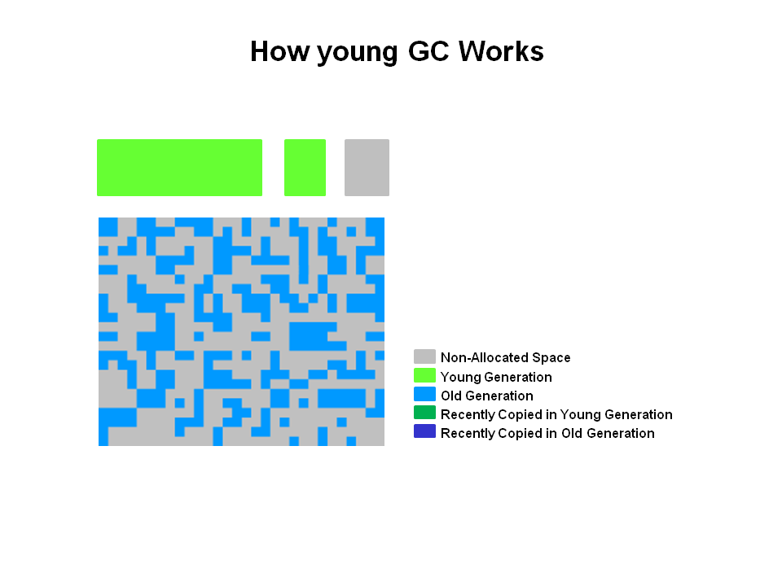

# CMS垃圾收集
## CMS垃圾收集器的堆内存结构
堆内存被划分为三个区域

新生代被划分为一个Eden区和两个Survivor区。老年代是相邻的一块区域。对象在这些区域被回收。除非出现一次Full GC，否则不会进行压缩。

## CMS中新生代的垃圾收集
下图是当你的应用程序运行一段时间后CMS堆内存的样子

### 新生代垃圾收集
存活的对象被从Eden区和一个Survivor拷贝到另一个Survivor区。其它达到晋升阈值的对象将被晋升到老年代。

### 新生代垃圾收集之后
在新生代垃圾收集结束后，Eden区和一个Survivor区是空的

## CMS老年代垃圾收集
### 标记
老年代垃圾收集有两次停顿在：初始标记阶段和重新标记阶段。当老年代达到设定的内存占比时，CMS将会对老年代进行垃圾收集。

1. 初始标记阶段会进行一次短暂的暂停，标记存活的对象。
2. 并发标记存活的对象，应用程序仍然可以继续运行。
3. 第二次暂停进行重新标记，标记由于上一阶段并发产生的需要标记的对象。

### 并发清除
未标记的对象将被清除。此时没有进行压缩操作。

注意：未标记的对象 == 死亡对象

### 老年代垃圾收集之后
并发清除之后，你可以看到很多空闲的内存

以上参考：https://www.oracle.com/technetwork/tutorials/tutorials-1876574.html

CMS和G1算法都涉及对可达对象的并发标记。并发标记的主要问题是collector在标记对象的过程中mutator可能正在改变对象引用关系图，从而造成漏标和错标。错标不会影响程序的正确性，只会造成所谓的浮动垃圾。但漏标则会导致可达对象被当做垃圾收集掉，从而影响程序的正确性。
>  CMS在整个收集过程中让所有新创建的对象都是黑色的， 也就是说在CMS GC进行中创建的对象在这轮收集都会保证存活。这样虽然会有floating garbage问题，但实现起来比较简单，收集速度受影响较小。

为解决漏标问题，GC Handbook一书首先将对象分为三类，即所谓的black对象，grey对象和white对象。white对象是那些还没有被collector标记到的对象；grey对象是那些自身已经被标记到，但其所有引用对象还没有处理的对象；而black对象则是自身已经被标记到，且其引用的所有对象也已经被标记的对象（包括直接引用和间接引用）。

基于上述分类，一个white对象在并发标记阶段会被漏标的充分必要条件是：
1. mutator插入了一个从black对象到该white对象的新引用
2. mutator删除了所有从grey对象到该white对象的直接或者间接引用。
因此，要避免对象的漏标，只需要打破上述2个条件中的任何一个即可。

Incremental update关注的是第一个条件的打破，即引用关系的插入（或者说发生了一个白对象的引用被赋值到一个黑对象的字段里）。Incremental update利用write barrier将所有新插入的引用关系都记录下来（例如说标记并压到marking stack上，或者是记录在类似mod-union table里。也就是把这个白对象变成灰色），最后以这些引用关系为根STW地重新扫描一遍，即避免了漏标问题。
> Incremental update的write barrier会拦截所有新插入的引用关系，并且按需要记录新的引用关系。常见实现会判断例如：a.foo = b 那么a是否是黑色对象而b是否是白色对象。也有完全不做过滤的变种。CMS具体使用的write barrier是无条件的，跟HotSpot VM除G1外的其它GC的card marking基本一样。

SATB关注的是第二个条件的打破，即引用关系的删除。SATB利用pre write barrier将所有即将被删除的引用关系的旧引用记录下来，同样是把这个白对象变成灰色，最后以这些旧引用为根STW地重新扫描一遍即可避免漏标问题。
> 这样做的实际效果是：如果一个灰对象的字段原本指向一个白对象，但在concurrent marker能扫描到这个字段之前，这个字段被赋上了别的值（例如说null），那么这个字段跟白对象之间的关联就被切断了。SATB write barrier保证在这种切断发生之前就把字段原本引用的对象变灰，从而杜绝了上述第二种情况的发生。

在CMS的Remark的上下文里，根集合指的是globals，stacks，registers还有整个Young Generation。

CMS是一个老年代的垃圾收集器，既然只收集Old Gen，它必须要把当前非收集区域的Young Gen作为root。这和一般的YGC时要把Old Gen的Remembered Set部分算作root道理一样，只不过HotSpot没有利用Card Table来进行扫描，而是将整个Young Gen作为root进行扫描。

在CMS的Initial Mark的上下文里，根集合并不包括Young Gen而是只有globals，stacks，registers。这是因为在接下来的Concurrent Mark阶段会顺着初始的根集合把Young Gen里的活对象都遍历了。所以从整个CMS的生命周期来看，Young Gen仍然是根集合的一部分。

但既然在Initial Mark和Concurrent Mark阶段已经扫过了Young Gen为什么还要在Remark阶段再扫一次？这就是因为CMS使用Incremental Update Write Barrier是一种“Grey Mutator”做法。

如果把mutator也看作一个虚构的对象，那么它应该也有黑灰白的划分。
Black Mutator：mutator一旦被初始化之后，到并发标记结束之前都不可以接触到白对象的指针，或者要确保接触到的白对象都被Grey-Protected（破坏条件2）。
Grey Mutator：在mutator初始化之后，到并发标记结束之前还可以继续接触白对象，只要在标记结束前重新扫描一次完整的根集合即可。

CMS的Write Barrier非常简单，只是在Card Table记录一下改变的引用的出发端对应的Card。那Mod-Union Table是啥？

其实很简单。Card Table只有一份，即要用来支持YGC又要来支持CMS。每次YGC都要重置和重新扫描Card Table，这样是满足了YGC的需求，但是破坏了CMS的需求—CMS需要的信息可能被YGC覆盖掉。

为了避免信息丢失，就在Card Table之外另外加了一个bitmap叫做Mod-Union Table。在CMS并发标记的过程中，每当发生一次YGC，当YGC要重置Card Table里的某个记录时，就会更新Mod-Union Table对应的bit。

这样，最后到CMS Remark的时候，当时的Card Table外加Mod-Union Table就足以记录在并发标记过程中old gen发生的所有引用变化了。

实际上Hotspot VM一般用的post-write barrier非常简单，就是无条件的记录下所有发生过引用关系变化的card。

这里即不关心field所在的分代，也不关心val的值，所以只要有引用改变，其对应的card都会被记录。也就是说card table记录的不只是old -> young（老年代对象对新生代对象的引用），而所有发生了变化的引用的出发端，无论在old还是young。

但是HotSpot VM只使用了old gen部分的card table，也就是说只关心old -> ?的引用。这是因为，一般认为young gen的引用变化率（mutation rate）非常高，其对应的card table部分可能大部分都是dirty的，当把young gen当做root扫描的时候与其扫描card table不如直接扫描整个young gen。

另外CMS在整个收集过程中让所有新创建的对象都是黑色的，也就是说在CMS GC进行中创建的对象在这轮收集都会保证存活。这样虽然会有floating garbage问题，但实现起来比较简单，收集速度受影响较小。