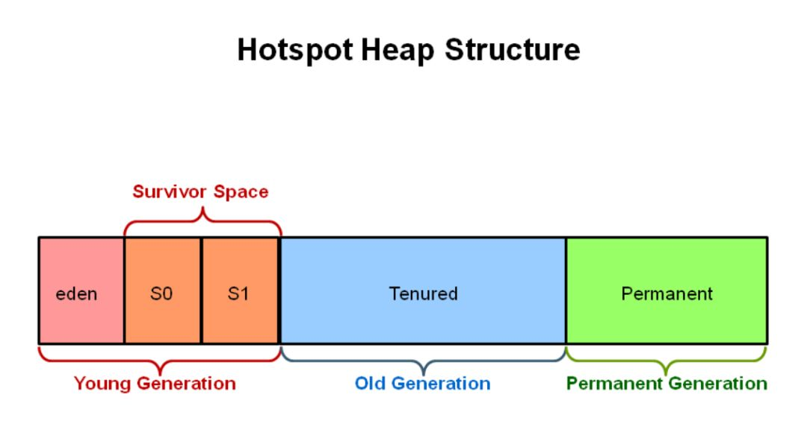

# G1
G1是一款在Server端运行的垃圾收集器，专门针对拥有多核处理器和大内存的机器，在JDK 7u4版本发行时被正式推出，在JDK9中更被指定为官方GC。它满足高吞吐量的同时满足GC停顿的时间尽可能短。G1专门针对以下场景设计

- 可以像CMS一样与应用并发运行
- 压缩空闲的内存碎片，却不需要冗长的GC停顿
- 对GC停顿可以做更好的预测
- 不想牺牲大量的吞吐量性能
- 不需要更大的堆内存

G1从长期计划来看是以取代CMS为目标。与CMS相比有几个不同点使得G1成为GC的更好解决方案。
1. G1会压缩空闲内存使之足够紧凑，做法是用regions代替细粒度的空闲列表进行分配，减少内存碎片的产生。
2. G1的STW更可控，G1在停顿时间上添加了预测机制，用户可以指定期望停顿的时间。

# 概览
传统的垃圾收集器（serial，parallel，CMS）无一例外都把Heap分成固定大小连续的三个空间：Young Generation，Old Generation，Permanent Generation。



但G1却独辟蹊径，采用了一种全新的内存布局


在G1中，堆被分成一块块大小相等的region，这些region在逻辑上是连续的。每块region都会被打上唯一的分代标志（eden，survivor，old）。在逻辑上，eden regions构成Eden区，survivor regions构成Survivor区，old regions构成了Old区。

与其它垃圾收集器一样，可以通过命令行参数`-XX:NewRatio=n`来配置新生代与老年代的比列；`-XX:SurvivorRatio=n`则可以配置Eden区与Survivor区的比例。

垃圾回收时G1的运行方式与CMS方式类似，会有一个全局并发标记的过程。并发标记完成之后，G1知道哪些regions的可回收对象更多，并优先回收这些regions，释放出大量的空闲空间。

**G1将其收集和压缩活动集中在堆中可能充满可回收对象的区域，使用暂停预测模型来满足用户定义的暂停时间目标，并根据指定的暂停时间目标选择要收集的区域数量。**

需要注意的是，G1不是实时收集器。它能够以较高的概率满足设定的暂停时间目标，但不是绝对确定的。根据以前收集的数据，G1估算出在用户指定的目标时间内可以收集多少个区域。因此，收集器对于收集区域的成本有一个相当准确的模型，它使用这个模型来确定在暂停时间目标内收集哪些区域和收集多少区域。

# G1中的Region
G1中每个Region大小是固定相等的，Region的大小可以通过参数-XX:G1HeapRegionSize设定，取值范围从1M到32M，且是2的指数。如果不设定，那么G1会根据Heap大小自动决定。

> size = (堆最小值+堆最大值) / 2 / TARGET_REGION_NUMBER(2048) ，然后size取最靠近2的幂次数值， 并将size控制在[1M, 32M]之间。

# G1中的GC收集
**G1保留了YGC并加上了一种全新的MIXGC用于收集老年代。G1中没有Full GC，G1中的Full GC是采用Serial Old Full GC。**

## YGC
当Eden空间被占满之后，就会触发YGC。在G1中YGC依然采用复制存活对象到Survivor区的方式，当对象的存活年龄满足晋升条件时，把对象提升到Old Generation Regions（老年代）。

G1控制YGC开销的手段是动态改变Young Region的个数，YGC的过程中依然会STW，并采用多线程并发复制对象，减少GC停顿时间。

YGC开始


YGC结束


从图中可以看到新生代经过一次YGC存活下来的对象被复制到了新的Region。

## MixedGC
从最高层看，G1的collector一侧其实就是两个大部分：
- 全局并发标记（global concurrent marking）
- 拷贝存活对象（evacuation）
而这两部分可以相对独立的执行。

### global concurrent marking
这个过程和CMS类似，老年代的使用率需要达到指定的值才会触发，通过-XX:InitiatingHeapOccupancyPercent指定，默认值45%。如果Mixed GC周期结束后老年代使用率还是超过45%，那么会再次触发全局并发标记过程，这样就会导致频繁的老年代GC，影响应用吞吐量。可以适当调高IHOP的值，当然如果此值太高，很容易导致年轻代晋升失败而触发Full GC，所以需要多次调整测试。


Global Concurrent Marking基于SATB形式的并发标记。它具体分为下面几个阶段：
#### 初始标记（initial marking）
**暂停阶段**。扫描根集合，标记所有从根集合可直接到达的对象并将它们的字段压入扫描栈（marking stack）中等到后续扫描。G1使用外部的bitmap来记录mark信息，而不使用对象头的mark word里的mark bit。在分代式G1模式中，初始标记阶段借用young GC的暂停，因而没有额外的、单独的暂停阶段，因此省去了沿着GC Root去trace整个新生代的过程。

#### 并发标记（concurrent marking）
**并发阶段**。不断从扫描栈取出引用递归扫描整个堆里的对象图。每扫描到一个对象就会对其标记，并将其字段压入扫描栈。重复扫描过程直到扫描栈清空。过程中还会扫描SATB write barrier所记录下的引用。

#### 最终标记（final marking，在实现中也叫remarking）
**暂停阶段**。在完成并发标记后，每个Java线程还会有一些剩下的SATB write barrier记录的引用尚未处理。这个阶段就负责把剩下的引用处理完。同时这个阶段也进行弱引用处理（reference processing）。
注意这个暂停与CMS的remark有一个本质上的区别，那就是这个暂停只需要扫描SATB buffer，而CMS的remark需要重新扫描mod-union table里的dirty card外加整个根集合，而此时整个young gen（不管对象死活）都会被当作根集合的一部分，因而CMS remark有可能会非常慢。

#### 清理（cleanup）
**暂停阶段**。清点和重置标记状态。这个阶段有点像mark-sweep中的sweep阶段，不过不是在堆上sweep实际对象，而是在marking bitmap里统计每个region被标记为活的对象有多少。如果发现完全没有活对象的region就会将其整体回收到可分配region列表中。这个阶段的主要工作有：识别出所有空闲的分区、RSet梳理、将不用的类从metaspace中卸载、回收巨型对象等等。这个阶段还会根据每个region的垃圾比率进行排序，-XX:G1MixedGCLiveThresholdPrecent指定当垃圾比率超过这个值时才会放到CSet当中。排序的标准则依赖prevBitMap和nextBitMap。

### Evacuation
Evacuation阶段是**全暂停**的。它负责把一部分region里的活对象拷贝到空region里去，然后回收原本的region的空间。
Evacuation阶段可以自由选择任意多个region来独立收集构成收集集合（collection set，简称CSet），靠per-region remembered set（简称RSet）实现。这是regional garbage collector的特征。

在选定CSet后，evacuation其实就跟ParallelScavenge的young GC的算法类似，采用并行copying（或者叫scavenging）算法把CSet里每个region里的活对象拷贝到新的region里，整个过程完全暂停。从这个意义上说，G1的evacuation跟传统的mark-compact算法的compaction完全不同：前者会自己从根集合遍历对象图来判定对象的生死，不需要依赖global concurrent marking的结果，有就用，没有拉倒；而后者则依赖于之前的mark阶段对对象生死的判定。

论文里提到的纯G1模式下，CSet的选定完全靠统计模型找出收益最高、开销不超过用户指定的上限的若干region。由于每个region都有RSet覆盖，要单独evacuate任意一个或多个region都没问题。

分代式G1模式下有两种选定CSet的子模式，分别对应young GC与mixed GC：
- Young GC：选定所有young gen里的region，通过控制young gen的region个数来控制young GC的开销。
- Mixed GC：选定所有young gen里的region，外加根据global concurrent marking统计得出收集收益高的若干old gen region。在用户指定的开销目标范围内尽可能选择收益高的old gen region。

可以看到young gen region总是在CSet内。因此分代式G1不维护从young gen region出发的引用涉及的RSet更新。（不维护年轻代对象对老年代对象的引用）

分代式G1的正常工作流程就是在young GC与mixed GC之间视情况切换，背后定期做做全局并发标记。Initial marking默认搭在young GC上执行；当全局并发标记正在工作时，G1不会选择做mixed GC，反之如果有mixed GC正在进行中G1也不会启动initial marking。

在正常工作流程中没有full GC的概念，old gen的收集全靠mixed GC来完成。

如果mixed GC实在无法跟上程序分配内存的速度，导致old gen填满无法继续进行mixed GC，就会切换到G1之外的serial old GC来收集整个GC heap（注意，包括young、old、perm）。这才是真正的full GC。Full GC之所以叫full就是要收集整个堆，只选择old gen的部分region算不上full GC。进入这种状态的G1就跟-XX:+UseSerialGC的full GC一样（背后的核心代码是两者共用的）。

顺带一提，G1 GC的System.gc()默认还是full GC，也就是serial old GC。只有加上 -XX:+ExplicitGCInvokesConcurrent 时G1才会用自身的并发GC来执行System.gc()——此时System.gc()的作用是强行启动一次global concurrent marking；一般情况下暂停中只会做initial marking然后就返回了，接下来的concurrent marking还是照常并发执行。

G1在mutator一侧需要使用write barrier来实现：
- SATB snapshot的完整性
- 跨region的引用记录到RSet里。

这两个动作都使用了logging barrier，其处理有一部分由collector一侧并发执行。

## SATB
SATB（snapshot-at-the-beginning）是保证在并发GC下程序正确性的一个手段。G1 GC的并发理论基础就是SATB。

SATB抽象的说就是在一次GC开始的时候是活的对象就被认为是活的，此时的对象图形成一个逻辑“快照”（snapshot）；然后在GC过程中新分配的对象都当作是活的。其它不可到达的对象就是死的了。

很容易知道哪些对象是一次GC开始之后新分配的：每个region记录着两个top-at-mark-start（TAMS）指针，分别为prevTAMS和nextTAMS。在TAMS以上的对象就是新分配的，因而被视为隐式marked。

但是在并发GC里，collector一边动mutator也一边动，如果collector并发mark的过程中mutator覆盖了某些引用字段的值而collector还没mark到那里，那collector不就得不到完整的snapshot了么？

为了解决这个问题就有了SATB write barrier。

前面提到SATB要维持“在GC开始时活的对象”的状态这个逻辑snapshot。除了从root出发把整个对象图mark下来之外，其实只需要用pre-write barrier把每次引用关系变化时旧的引用值也记下来就好了。这样，等concurrent marker到达某个对象时，这个对象的所有引用类型字段的变化全都有记录在案，就不会漏掉任何在snapshot里活的对象。当然，很可能有对象在snapshot中是活的，但随着并发GC的进行它可能本来已经死了，但SATB还是会让它活过这次GC。

> 在每次引用关系发生变化时，旧的引用所指向的对象就会被mark上，其子孙也会被递归mark上，这样就不会漏mark任何对象，snapshot的完整性也就得到了保证。（旧的引用所指向的对象既是“在GC开始活的对象”）

但实际去看G1的论文和代码，会发现它的pre-write barrier却没有检查目标对象是否已经mark，也不去对目标对象做mark和扫描它的字段。
实际上该做的事情还是得做，只是不在这里做而已。后面讲到logging write barrier的时候就会展开说明了。

> CMS的incremental update设计使得它在remark阶段必须重新扫描所有线程栈和整个young gen作为root；G1的SATB设计在remark阶段则只需要扫描剩下的satb_mark_queue。

## logging write barrier
为了尽量减少write barrier对mutator性能的影响，G1将一部分原本要在barrier里做的事情挪到别的线程上并发执行。

实现这种分离的方式就是通过logging形式的write barrier：mutator只在barrier里把要做的事情的信息记（log）到一个队列里，然后另外的线程从队列里取出信息批量完成剩余的动作。

以SATB write barrier为例，每个Java线程有一个独立的、定长的SATBMarkQueue，**mutator在barrier里只把old_value压入该队列中**。一个队列满了之后，它就会被加到全局的SATB队列集合SATBMarkQueueSet里等待处理，然后给对应的Java线程换一个新的、干净的队列继续执行下去。

并发标记（concurrent marker）会定期检查全局SATB队列集合的大小。当全局集合中队列数量超过一定阈值后，concurrent marker就会处理集合里的所有队列：把队列里记录的每个oop（ordinary object pointer）都标记上，并将其引用字段压到标记栈（marking stack）上等后面做进一步标记。

## "Points-into" remembered set
G1 GC的heap与HotSpot VM的其它GC一样有一个覆盖整个heap的card table。
逻辑上说，G1 GC的remembered set（下面简称RSet）是每个region有一份。这个RSet记录的是从别的region指向该region的card（谁引用了我）。所以这是一种“points-into”的remembered set。

用card table实现的remembered set通常是points-out的，也就是说card table要记录的是从它覆盖的范围出发指向别的范围的指针（我引用了谁）。以分代式GC的card table为例，要记录old -> young（老年代对象对新生代对象的引用）的跨代指针，被标记的card是old gen范围内的。

G1 GC则是在points-out的card table之上再加了一层结构来构成points-into RSet：每个region会记录下到底哪些别的region有指向自己的指针，而这些指针又分别在region的哪些card的范围内。
这个RSet其实是一个hash table，key是别的region的起始地址，value是一个集合，里面的元素是card table的index。

**这样做的好处是**：在扫描跨代（老年代引用新生代）的对象时，point-out的方式不得不遍历老年代的card table，找到所有的dirty card。而point-in的方式，只需要扫描自己本身的RSet就可以了。

每次向引用类型字段赋值都要经过这么多步骤来更新RSet的话开销实在太大，而实际G1的实现则再一次用到了logging barrier（logging write barrier），这是logging barrier在G1 write barrier上的又一次应用。

跟SATB marking queue类似，每个Java线程有一个dirty card queue，也就是论文里说的每个线程的remembered set log；然后有一个全局的DirtyCardQueueSet，也就是论文里说的全局的filled RS buffers。

实际更新RSet的动作就交由多个ConcurrentG1RefineThread并发完成。每当全局队列集合超过一定阈值后，ConcurrentG1RefineThread就会取出若干个队列，遍历每个队列记录的card并将card加到对应的region的RSet里去。

## Bitmap
G1的concurrent marking用了两个bitmap：
一个prevBitmap记录第n - 1轮concurrent marking所得的对象存活状态。由于第n - 1轮concurrent marking已经完成，这个bitmap的信息可以直接使用。
一个nextBitmap记录第n轮concurrent marking的结果。这个bitmap是当前将要或正在进行的concurrent marking的结果，尚未完成，所以还不能使用。

对应的，每个region都有这么几个指针：
```
  |<-- (1) -->|<-- (2) -->|<-- (3) -->|<-- (4) -->|
bottom    prevTAMS    nextTAMS       top         end
```

其中top是该region的当前分配指针，[bottom, top)是当前该region已用（used）的部分，[top, end)是尚未使用的可分配空间（unused）。
1. [bottom, prevTAMS): 这部分里的对象存活信息可以通过prevBitmap来得知
2. [prevTAMS, nextTAMS): 这部分里的对象在第n - 1轮concurrent marking是隐式存活的
3. [nextTAMS, top): 这部分里的对象在第n轮concurrent marking是隐式存活的

> 参考：https://hllvm-group.iteye.com/group/topic/44381  
> 参考：https://www.oracle.com/technetwork/tutorials/tutorials-1876574.html  
> 参考：https://blog.csdn.net/u014274324/article/details/106975775