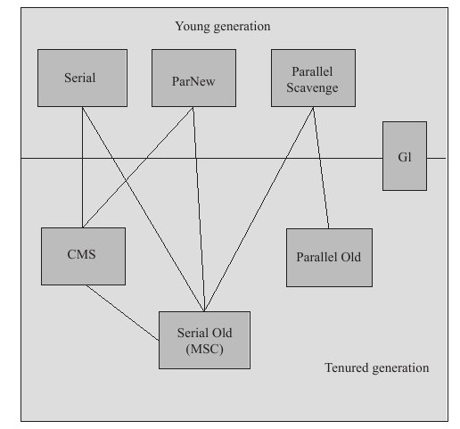

# 垃圾收集器

上图展示了7种作用于不同分代的垃圾收集器，如果两个收集器之间存在连线，就说明他们可以搭配使用。收集器所处的区域，则表示它是属于新生代收集器还是老年代收集器。

JVM没有实现具体的自动内存管理系统，虚拟机的实现者应该依据系统需求选择内存管理技术。

# Serial收集器
包括新生代的Serial收集器和老年代中称为Serial Old的收集器。

Serial收集器使用单线程完成所有的垃圾收集工作，这使得它相对来说更有效，因为没有线程之间通信的开销。

新生代中使用Serial收集器时，采用上篇描述的方式运行，而老年代中使用时则采用**滑动压缩标记-清除**（Sliding Compacting Mark-Sweep）算法，也称为**标记-压缩**（Mark-Compact）垃圾收集器。它的Minor GC和Full GC都是以Stop The World方式（即收集时应用程序停止运行）运行，只有等垃圾收集结束后，应用程序才会继续执行。

标记压缩收集器首先找出老年代中有哪些依然存活的对象，然后将它们滑向老年代空间的头部，从而将所有的空闲空间留在尾部的连续块中。这使得将来任何在老年代中的分配操作（大多数是从新生代提升到老年代）都可以使用快速的指针碰撞技术。

Serial收集器适合大多数对停顿时间要求不高和在客户端运行的应用。虽然它仅用一个虚拟处理器进行垃圾收集（Serial之名即由此而来），但在现有的硬件条件下，它仍然只需要几百兆Java堆就能有效管理许多重要的应用，并且最差情况下仍然能保持比较短的停顿（Full GC大约几秒钟）。

同一台机器上运行大量JVM实例（某些情况下JVM的实例数超过了可用的处理器数）时，也常用Serial收集器。当JVM进行垃圾收集时，最好只用一个处理器，虽然会使垃圾收集的时间有所延长，但对其他JVM的干扰最小，这方面Serial收集器处理得很好。

# Parallel收集器：吞吐量为先
HotSpot VM中能够并行的垃圾收集器包括Parallel Scavenge收集器、ParNew收集器（配合CMS的并行回收）和Parallel Old收集器。

现在许多重要的Java应用都运行在有大量物理内存和多处理的服务器上。理想情况下，垃圾收集器应该充分利用所有可用的处理器资源，并且当它在进行垃圾收集时也不会让多数处理器空闲。

为了减少垃圾收集的开销从而增加服务类应用的吞吐量，HotSpot VM自带了Parallel收集器，也称为Throughput收集器（通过并行都能提高吞吐量，HotSpot VM中的Throughput收集器通常特指Parallel Scavenge收集器）。它的操作方式和Serial收集器类似（即在新生代采用Stop-The-World方式收集，而老年代采用标记-压缩方式）。然而，Minor GC和Full GC都是并行的，使用所有可能的处理器资源，以此来提高垃圾收集的速度。

**需要高吞吐量的应用，以及运行在多处理系统之上的应用，可以从Parallel收集器获益。**

# Mostly-Concurrent收集器：低延迟为先
对于许多应用来说，快速响应比端到端的吞吐量更为重要。在Stop-The-World模式中，应用线程在垃圾收集开始时停止，直到垃圾收集结束后才继续运行和处理外部请求。Minor GC通常不会导致长时间的停顿，然而Full GC或压缩式垃圾收集，即便不频繁，也会导致长时间停顿，特别是Java堆比较大的时候。

为了应对这种情形，HotSpot VM引入了Mostly-Concurrent收集器，也称为**并发标记清除收集器**（Concurrent Mark-Sweep GC，CMS收集器）。它管理新生代的方式与Serial收集器和Parallel收集器相同，而它在老年代则是尽可能并发执行，每个垃圾收集周期只有2次短的停顿。

CMS垃圾收集过程：
1. 开始有**一个短的停顿**，称为**初始标记**（Initial Mark），它标记那些从根集合（globals，stacks，registers）直接可达的对象。
2. 然后，在**并发标记阶段**（Concurrent Marking Phase），从“上一阶段被标记的对象”出发，CMS通过遍历堆中的对象图来标记所有可达的存活对象。因为在标记期间应用可能正在运行并更新引用，所以并发标记阶段结束时，未必所有存活的对象都能确保被标记。（步骤4处理了这一情况）
3. 为了减少重新标记时的工作量，CMS收集器引入了并发**预清除**（Pre-Cleaning）阶段。该阶段通过扫描Card Table，重新标记那些在并发标记阶段引用被更新的对象。
4. 这一阶段应用需要**再次停顿**，称为**重新标记**（Remark），重新扫描根集合，同时也要把card table和mod-union table记录下的在old gen里发生了变化的引用重新扫描一遍，并对这些对象进行最后的标记。
5. 找到了老年代中所有的存活对象之后，垃圾收集的最后阶段就是**并发清除**（Concurrent Sweeping），清除整个Java堆，释放没有被标记的垃圾对象。此时没有压缩操作。

> 除了以上5个阶段外，其实在**预清除**阶段之后还有**可中断的预清除**阶段。以及在**并发清除**阶段之后还有**并发重置**阶段。详细的CMS GC日志可以查看[📜](./attachment/GC-LOG.md)。

并发清除之后，空闲区域并不是连续的，这时垃圾收集器需要使用一个数据结构（HotSpot VM中使用空闲列表）记录哪部分堆有空闲空间。**因此老年代分配空间的代价更昂贵**，因为空闲列表的分配不如指针碰撞方法有效。这使Minor GC会产生额外的开销，因为当发生对象晋升时，会在老年代中造成大量的分配。

CMS与前两个垃圾收集器相比还有一个缺点，就是**需要更大的Java堆**。首先，CMS垃圾收集的周期时间长于Stop-The-World垃圾收集所用的时间，同时只有在清除阶段，空间才会真的回收。其次，尽管垃圾收集器确保在标记阶段标识所有存活的对象，但实际上它无法保证找出所有的垃圾对象。标记阶段成为垃圾的对象在周期内可能被收集也可能不被收集。如果没有，则它将在下一周期被收集，这时就产生了**浮动垃圾**（Floating Garbage）。最后，缺乏压缩会形成**空间碎片化**（Fragmentation），这将导致垃圾收集器无法最大程度地利用所有可用的空闲空间。

在回收周期中，如果尚未回收到足够的空间之前，老年代满了，CMS就会退而求其次，使用代价昂贵的Stop-The-World进行空间压缩，就像Parallel收集器和Serial收集器那样。

与Parallel收集器相比，CMS老年代停顿变短了（有时相当可观），但代价是新生代停顿略微拉长（因为对象晋升时内存分配的效率下降了？）、吞吐量有所降低、堆的大小有所增长，并且由于并发，垃圾收集器会占用应用程序的CPU周期。**需要快速响应的应用可以从中受益。**
