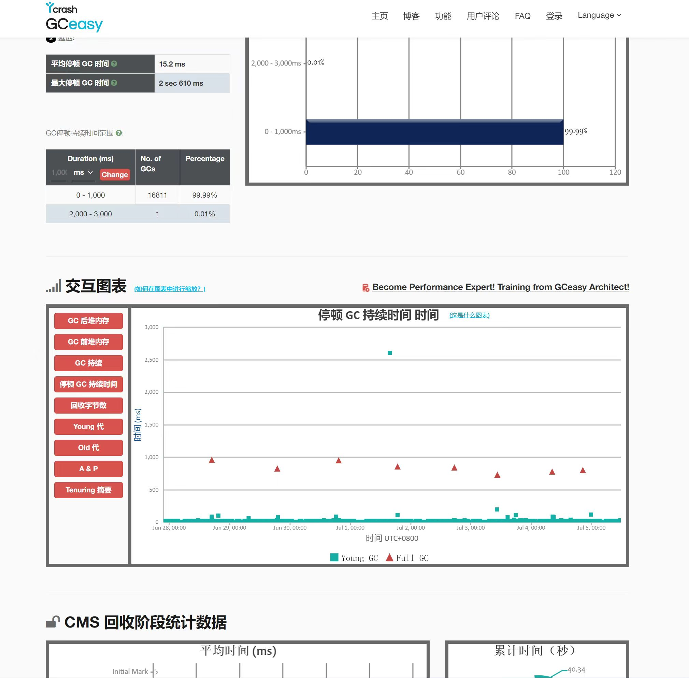
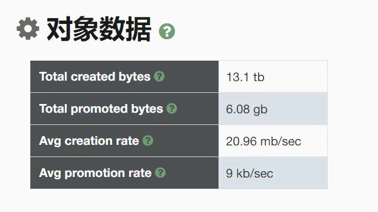
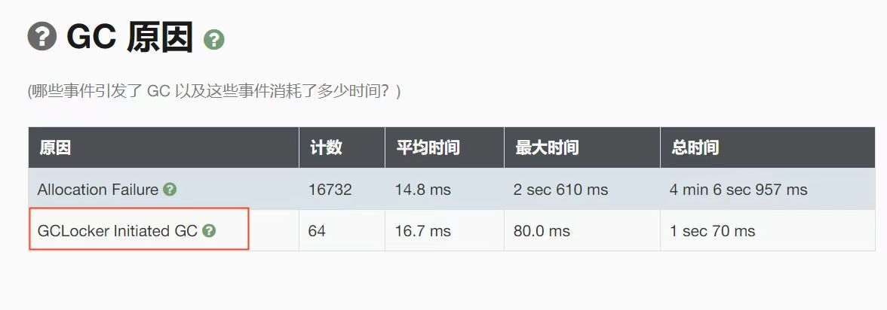

# JVM调优
通用法则之一：将Java堆的初始值-Xms和最大值-Xmx设置为老年代活跃数据大小的3-4倍。

通用法则之二：永久代的初始值-XX:PermSize及最大值-XX:MaxPermSize应该是永久代活跃数据的1.2-1.5倍。

补充法则：新生代空间应该为老年代空间活跃数据的1-1.5倍。

## 新生代
如果观测到YGC的平均持续时间大于应用程序的延迟性要求，可以适当减小新生代空间的大小，之后再运行测试，收集GC统计数据之后再次评估数据。如果观测到的YGC频率大于应用程序的延迟性要求（发生的太频繁），增大新生代空间，之后再运行测试，收集GC统计数据之后再次评估数据。（调整新生代空间大小时，尽量保持老年代空间大小恒定）

调整新生代大小时，需要谨记下面几个准则：
- 老年代空间大小不应该小于活跃数据大小的1.5倍。
- 新生代空间至少应该为Java堆大小的10%，通过-Xmn和-XX:NewRation可以设定该值。
- 增大Java堆大小时，需要注意不要超过JVM可用的物理内存。（使用交换内存反而造成性能降低）

### Survivor
减少Eden空间会导致更频繁的YGC，垃圾收集发送的频率越高，对象老化的速度就越快。

-XX:+PrintTenuringDistribution：输出每次YGC时晋升分布的情况

通常情况下，观察到新的晋升阈值持续小于最大晋升阈值，或者观察到Survivor空间大小小于总的存活对象大小（即对象年龄最后最后列的值）都表明Survivor空间过小。

通常情况下，即使在Survivor空间之间多次复制对象也比匆匆将对象提升到老年代要好。

## 老年代
老年代的空间占用情况可以通过YGC之后Java堆的占用情况 减去 同一次YGC后新生代的空间占用得到

提升率 = 每次YGC老年代空间占用增量 / YGC频率，例如：20MB/次 / 2s/次 = 10MB/s

得到 提升率 后，填充老年代可用空间的时间 = 可用空间大小 / 提升率，例如：
老年代可用空间大小为2048MB，提升率为10MB/S，占用老年代多需要的时间则为 2048 / 10 = 204.8S，大约是4分钟左右。

如果预期或观测到FGC的频率已经远远不能达到应用程序的最差FGC频率要求，就应该增大老年代空间的大小。（增加老年代空间的大小时注意保持新生代空间大小恒定）

## CMS
从Throughput迁移到CMS时，如果发生新生代至老年代的对象提升，可能会经历较长的YGC持续时间，这是由于对象提升到老年代变得更慢了。因为CMS在老年代空间从空闲列表中分配内存。与之相反，Throughput收集器只需要在线程本地分配的提升缓存中移动指针即可。

1. 内存分配效率降低
2. 吞吐量降低

使用CMS时，如果老年代空间用尽，就会触发一个单线程STW压缩式的垃圾收集。

从Throughput收集器迁移到CMS收集器时需要遵循的一个通用原则是，将老年代空间增大20%-30%。

CMS调优面临的问题：
1. 对象从新生代提升至老年代的速率。
2. 并行老年代垃圾收集线程回收空间的速率。
3. 碎片化。

解决碎片化的方案：
1. 压缩老年代空间。单STW压缩式GC耗时较长，应该尽量避免。
2. 让老年代的空间大到足以避免由堆内存碎片引起的STW压缩。
3. 减少对象从新生代提升至老年代的比率，即“YGC回收原则”。

# GC日志分析
GC日志在线分析：`https://gceasy.ycrash.cn/`，以下是部分分析结果的截图

# JVM参数
## Log
-verbose:gc：启用GC日志输出。显示简要的GC概要信息。

-XX:+PrintGCDetails：打印详细的GC日志信息，包括堆大小、垃圾回收的原因、回收前后的堆状态等。

-XX:+PrintGCTimeStamps：在GC日志中打印每个GC事件的时间戳。

-XX:+PrintGCDateStamps：在GC日志中打印每个GC事件的日期和时间。

-Xloggc：指定GC日志文件的位置和名称。

-XX:+UseGCLogFileRotation：开启GC日志文件轮转。

-XX:NumberOfGCLogFiles：指定GC日志文件保留的数量。

-XX:GCLogFileSize：设置单个GC日志文件的最大大小。

-XX:+PrintGCApplicationStoppedTime：在GC日志中打印应用程序停顿的时间。

-XX:+HeapDumpOnOutOfMemoryError：在发生OutOfMemoryError时生成堆转储快照。

-XX:+PrintPromotionFailure：打印在对象晋升（从年轻代到老年代）过程中失败的次数和原因。

-XX:+CMSDumpAtPromotionFailure：在对象晋升失败时进行CMS（Concurrent Mark-Sweep）转储。

-XX:+PrintTenuringDistribution：打印年龄分布信息，即年轻代中各个对象的年龄。

-XX:+PrintFlagsFinal：打印JVM选项和系统属性的最终值。

🌰：`-verbose:gc -XX:+PrintGCDateStamps -XX:+PrintGCDetails -XX:+PrintGCCause  -XX:+PrintTenuringDistribution -Xloggc:/opt/kuaidi100/runnable_jar/shipper/logs/gc-%t.log  -XX:+UseGCLogFileRotation -XX:NumberOfGCLogFiles=5 -XX:GCLogFileSize=20M`

## Heap
-Xms：指定JVM初始堆内存大小。例如，-Xms512m表示将初始堆大小设置为512MB。

-Xmx：指定JVM堆内存的最大值。例如，-Xmx1024m表示将堆内存的最大值设置为1GB。

-Xmn：指定年轻代（Young Generation）的大小。年轻代包含Eden区和Survivor区。例如，-Xmn256m表示将年轻代的大小设置为256MB。

-XX:NewRatio：设置新生代（年轻代）与老年代（年老代）内存大小的比率。默认值为2，表示新生代与老年代的比例为1:2。

-XX:SurvivorRatio：设置Eden区和Survivor区的比率。默认值为8，表示Eden区与每个Survivor区的比例为8:1。

-XX:PermSize：指定永久代（Permanent Generation）的初始大小。仅适用于Java 8之前的版本。

-XX:MaxPermSize：指定永久代的最大大小。仅适用于Java 8之前的版本。

-Xss：设置线程栈的大小。这个值会影响可以创建的线程数量。默认值因平台而异。

-XX:MaxDirectMemorySize：指定直接内存的最大大小。直接内存用于NIO（New Input/Output）操作，它不受Java堆大小的限制。

🌰：`-Xms4G -Xmx4G -Xmn1G -XX:SurvivorRatio=8 -XX:MaxDirectMemorySize=2G`

## GC
-XX:+UseSerialGC：使用Serial垃圾收集器。

-XX:+UseParallelGC：使用Parallel垃圾收集器。

-XX:+UseParallelOldGC：老年代使用并行的方式进行垃圾收集。

-XX:+UseParNewGC：新生代使用并行的方式进行垃圾收集。

-XX:+UseConcMarkSweepGC：使用CMS垃圾收集器（从JDK9开始不推荐使用CMS收集器）。

-XX:CMSMaxAbortablePrecleanTime=5000：默认值5s，代表该阶段最大的持续时间。

-XX:CMSScheduleRemarkEdenPenetration=50：默认值50%，代表Eden区使用比例超过50%就结束该阶段进入remark。

-XX:+UseG1GC：使用G1垃圾收集器。

-XX:+UseZGC：使用Z垃圾收集器。

🌰：`-XX:+UseParNewGC -XX:+UseConcMarkSweepGC -XX:CMSInitiatingOccupancyFraction=80 -XX:+UseCMSInitiatingOccupancyOnly -XX:+CMSParallelRemarkEnabled`