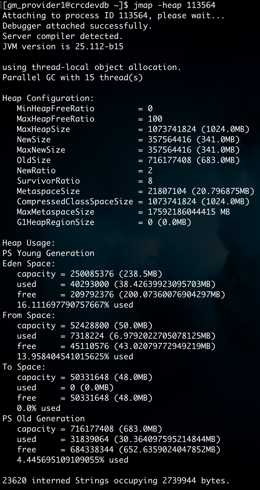
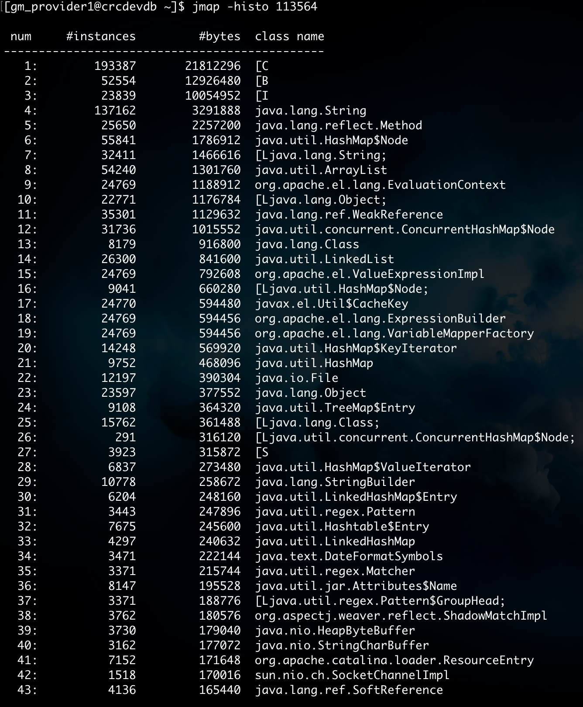

# JMAP
```
Usage:
    jmap [option] <pid>
        (to connect to running process)
    jmap [option] <executable <core>
        (to connect to a core file)
    jmap [option] [server_id@]<remote server IP or hostname>
        (to connect to remote debug server)

where <option> is one of:
    <none>               to print same info as Solaris pmap
    -heap                to print java heap summary
    -histo[:live]        to print histogram of java object heap; if the "live"
                         suboption is specified, only count live objects
    -clstats             to print class loader statistics
    -finalizerinfo       to print information on objects awaiting finalization
    -dump:<dump-options> to dump java heap in hprof binary format
                         dump-options:
                           live         dump only live objects; if not specified,
                                        all objects in the heap are dumped.
                           format=b     binary format
                           file=<file>  dump heap to <file>
                         Example: jmap -dump:live,format=b,file=heap.bin <pid>
    -F                   force. Use with -dump:<dump-options> <pid> or -histo
                         to force a heap dump or histogram when <pid> does not
                         respond. The "live" suboption is not supported
                         in this mode.
    -h | -help           to print this help message
    -J<flag>             to pass <flag> directly to the runtime system
```
参数说明：  
-heap：打印jvm heap的概要，包括分代的大小，比例及使用量。  
-histo：打印jvm heap的直方图，包括对象数量，占用大小及类型。  
-histo[:live]：同上，但是只打印存活对象的情况。  
-clstats：打印类加载统计信息。
 
从安全点日志看，从Heap Dump开始，整个JVM都是停顿的，考虑到IO（虽是写到Page Cache，但或许会遇到background flush），几G的Heap可能产生几秒的停顿，在生产环境上执行时谨慎再谨慎。

Dump出来的文件建议用JDK自带的VisualVM或Eclipse的MAT插件打开，对象的大小有两种统计方式：
- 本身大小(Shallow Size)：对象本来的大小。
- 保留大小(Retained Size)： 当前对象大小 + 当前对象直接或间接引用到的对象的大小总和。

看本身大小时，占大头的都是char[] 、byte[]之类的（**用jmap -histo:live pid 看的也是本身大小**）。我们需要关心的是保留大小比较大的对象，看谁在引用这些char[], byte[]。

MAT能看的信息更多，但VisualVM胜在JVM自带，用法如下：命令行输入jvisualvm，文件 > 装入 > 堆Dump > 检查 > 查找20保留大小最大的对象，就会触发保留大小的计算，然后就可以在类视图里浏览，按保留大小排序了。

## jmap -heap <pid>
展示pid的整体堆信息


- MinHeapFreeRatio：JVM堆内存最小空闲比率。它定义了堆内存被使用后剩余空间的最小比例，当堆内存的空闲比例低于这个值时，垃圾回收器可能会触发堆扩展或其他回收动作来增加可用空间。
- MaxHeapFreeRatio：JVM堆内存最大空闲比率。它定义了堆内存在使用后可以保持的最大空闲空间比例，当堆内存的空闲比例超过该值时，垃圾回收器可能会减少可用空间，进行堆收缩以节省内存。
- MaxHeapSize：堆内存的最大大小。
- NewSize：新生代默认大小。
- MaxNewSize：新生代最大大小。
- OldSize：老年代大小。
- NewRatio：新生代与老年代的大小比率。如：2，表示新生代与老年代比值为1:2，新生代占整个堆内存的1/3，老年代占整个堆内存的2/3。
- SurvivorRatio：年轻代中Eden区与两个Survivor区的比值。注意Survivor区有两个，如：8，表示Eden区与Survivor区比值为8:2，一个Survivor区占整个年轻代的1/10。
- MetaspaceSize：元空间大小（JDK8 HotSpot JVM 使用本地内存来存储类元数据信息并称之为元空间（Metaspace））。
- CompressedClassSpaceSize：类指针压缩空间大小，默认为1G。
- MaxMetaspaceSize：元空间最大大小。
- G1HeapRegionSize：G1区块的大小，取值为1M至32M，其取值是要根据最小Heap大小划分出2048个区块。

新生代的内存回收就是采用空间换时间的方式，如果from区使用率一直是100% 说明程序在不断创建大量的实例，使用jstat统计一下jvm在内存回收中发生的频率、耗时以及是否有full gc，使用这些数据来评估内存配置参数、gc参数是否合理。

## jmap -histo <pid>
展示类对象的数量及内存占用

 
- #instances：表示对象的实例个数
- #bytes：总占用字节数
- class name：对应Class文件里的class标识
  - B代表byte
  - C代表char
  - D代表double
  - F代表float
  - I代表int
  - J代表long
  - S表示short
  - Z代表boolean
  - 前边有[代表数组，[I代表int数组，对象以[L开头
 
输出堆内存镜像到二进制文件：`jmap -dump:live,format=b,file=dump.bin <pid>`

