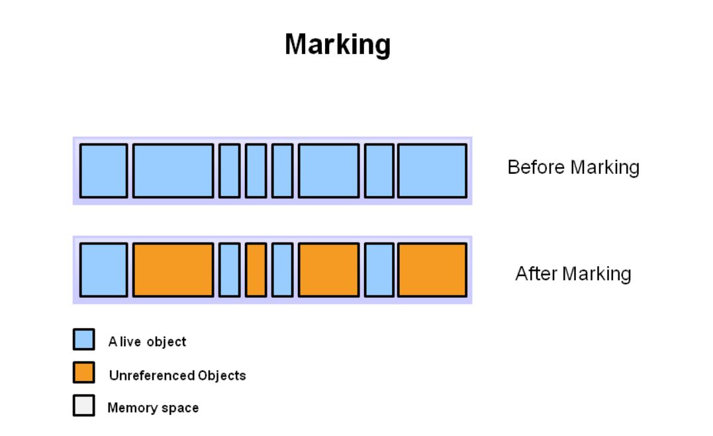
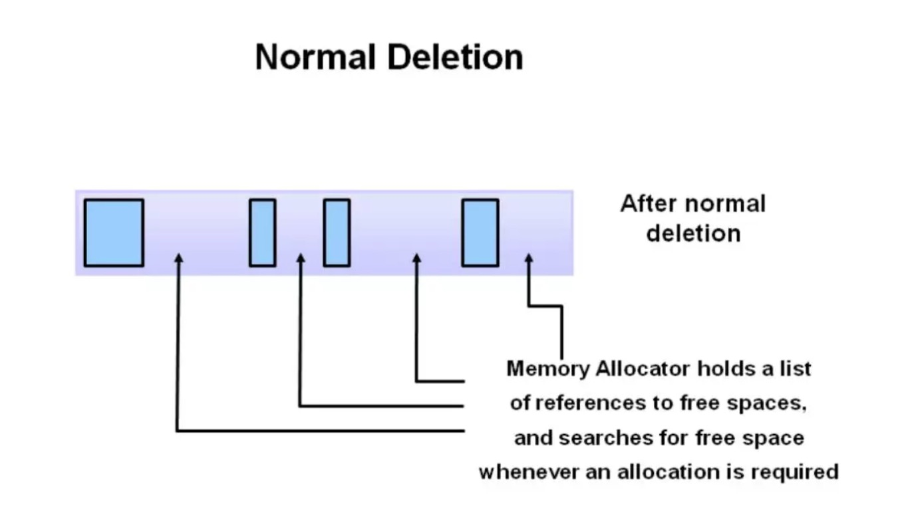
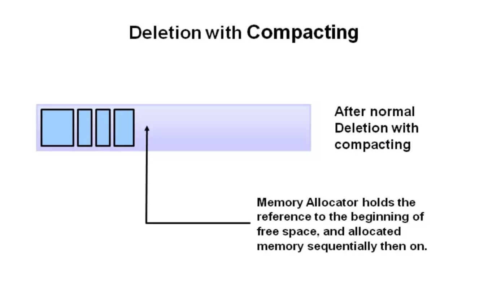
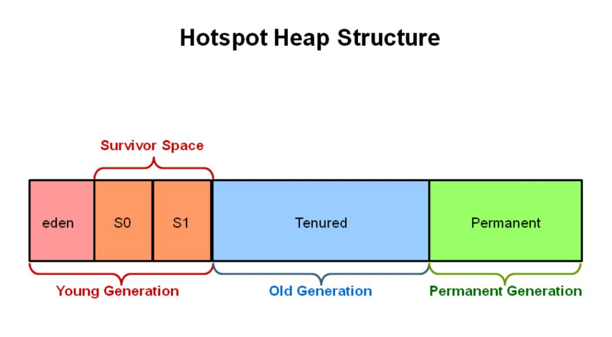

# 什么是垃圾收集
垃圾收集（Garbage Collection）是指在计算机程序执行过程中，自动回收和释放不再使用的内存空间的过程。

当我们在程序中创建对象时，通常会通过关键字 new 在堆上分配内存。但是，随着程序的执行，有些对象可能不再被引用或访问，这就形成了所谓的垃圾（Garbage）。如果不及时回收这些垃圾占用的内存，将会导致内存泄漏和资源浪费。

然而，垃圾收集并非没有开销。它需要占用计算资源来执行垃圾收集算法，并且可能会导致短暂的停顿或延迟。因此，在设计和优化程序时，需要考虑合理的内存分配、对象生命周期管理和垃圾收集策略，以平衡程序的性能和资源利用。

# 如何定位垃圾
**引用计数（Reference Counting）**：每个对象维护一个引用计数器，记录当前有多少个指向该对象的引用。当引用计数减少为0时，表示该对象不再被引用，可以被回收。但引用计数算法难以处理循环引用的情况，并且需要额外的开销来更新引用计数器。

**可达性分析算法**：基于根节点（Roots）和引用关系来确定对象的可达性。根节点包括静态变量、线程栈中的局部变量和JNI（Java Native Interface）引用。通过从根节点出发，递归遍历对象图，将所有被引用到的对象标记为活动对象，而未被标记的对象则被视为垃圾。

根对象（GC roots）：线程栈变量（局部变量），静态变量，常量池，JNI指针

which instances are roots?
- JVM stack：栈对象
- natvie method stack：本地方法栈里面的对象
- run-time constant pool：常量池对象
- static references in method area：静态变量
- clazz：class对象

# 垃圾回收算法
**标记-清除算法（Mark and Sweep）**：该算法首先通过可达性分析，标记出存活的对象。然后，在清除阶段，将未被标记的对象视为垃圾，并进行回收。可以看出回收过程需要进行两次扫描，并且，标记-清除算法存在碎片问题，即空闲内存空间可能被分割成多个小块，不利于后续对象的分配。（适用于存活对象较多的场景）

**复制算法（Copying）**：复制算法将堆内存划分为两个区域，通常称为"from"空间和"to"空间。在垃圾收集过程中，只对"from"空间中存活的对象进行标记，然后将它们复制到"to"空间中。最后，清空整个"from"空间。这样可以避免了碎片问题，但也浪费了一部分内存。（适用于存活对象较少的场景）

**标记-压缩算法（Mark and Compact）**：该算法结合了标记和复制的思想。首先通过可达性分析，标记出存活的对象。然后，将存活的对象紧凑地移动到一端，清理掉剩余的空间，以便后续的对象分配。标记-压缩算法既解决了碎片问题，也避免了复制算法的内存浪费。由于压缩阶段产生了内存复制和移动的操作，因此可能需要消耗更多的时间和内存带宽。

**分代收集算法（Generational）**：分代收集是一种把堆内存划分为不同代的垃圾收集方式。通常将新创建的对象分配到"新生代"中，而经过多次垃圾回收仍然存活的对象则会被晋升到"老年代"。由于大部分对象的生命周期很短，因此在新生代使用复制算法，而在老年代使用标记-压缩算法。这样可以根据对象的不同特性，针对性地进行垃圾回收，提高效率。

# 垃圾收集的过程
## 标记
垃圾收集的第一阶段是标记，垃圾收集器在此阶段对未被引用的对象进行标记。

上图中的蓝色方块表示被引用的对象，橙色方块表示未被引用的对象。垃圾收集器要对所有对象进行检查，以标记那些未被引用的对象，标记后如上图After Marking所示。

## 清除
这一阶段会删除标记出的未被引用的对象。

内存分配器会保存一份指向可用内存的引用的列表，以供分配新对象。

## 压缩
为了提升内存分配的性能，删除未被引用的对象后，将剩下的对象进行整理压缩，这样就能更简单快捷的分配内存。

# 为什么需要分代垃圾收集
如上所述，逐一标记和压缩的方法非常低效：对象越多，垃圾收集的时间就越长。但经过统计发现，大部分对象的生命周期很短。

## JVM分代
JVM把堆内存分成几个部分，分别是新生代、老年代和永久代。
