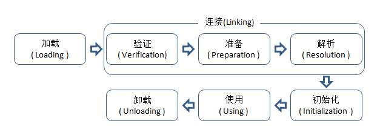
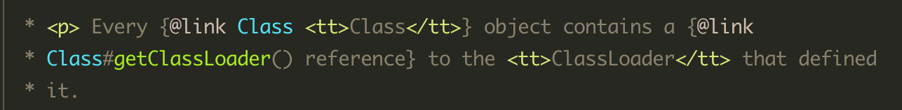
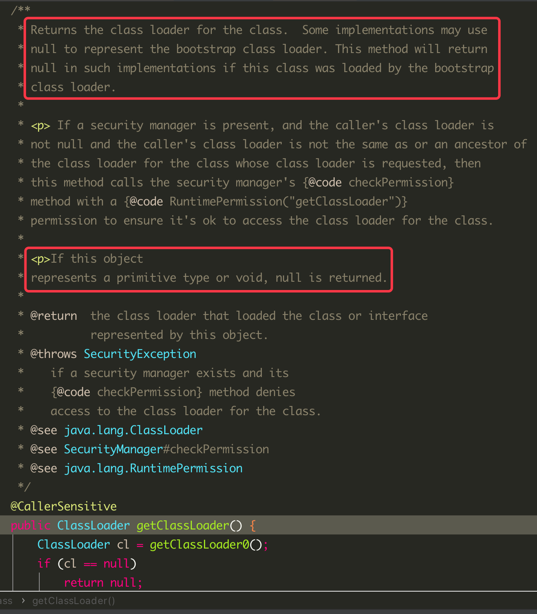

# JAVA虚拟机与程序的生命周期
- 执行了`System.exit();`
- 程序正常执行结束
- 程序在执行过程中遇到异常或错误而终止
- 由于操作系统出现错误导致JAVA虚拟机进程终止

在如上几种情况下，JAVA虚拟机将结束自己的生命周期。

# 类的生命周期
类的整个生命周期包括：加载（Loading）、验证（Verification）、准备（Preparation）、解析（Resolution）、初始化（Initialization）、使用（Using）和卸载（UnLoading）7个阶段。其中验证、准备、解析3个阶段统称为连接（Linking）。如图所示：

加载、验证、准备、初始化和卸载这5个阶段的先后顺序是不变的。而解析阶段则不一定：它在某些情况下可以在初始化阶段之后再开始，这是为了支持Java语言的运行时绑定（也称为动态绑定或晚期绑定）。

> 动态绑定是指在运行时根据对象的实际类型确定要调用的方法。
> 1. Java的多态性是通过动态绑定和方法重写来实现的
> 2. 动态绑定是通过将类的解析阶段放到初始化阶段之后来实现的
> 
> 从以上2点推导出Java的多态是通过将类的解析阶段放到初始化阶段之后来实现的？

# 加载
查找并加载类的二进制数据，在加载阶段虚拟机需要完成以下三件事：
1. 将类的.class文件的二进制数据读取到内存中。
2. 然后将其放在JVM运行时数据区的方法区内（方法区用于存放已被虚拟机加载的类信息、常量、静态变量、即时编译器编译后的代码等数据）。
3. 最后在堆内存空间创建一个java.lang.Class对象，用来封装类在方法区的数据结构。

Class对象封装了类在方法区的数据结构，并向用户提供了访问的接口。

## JAVA程序对类的使用方式可以分为两种：
### 主动使用
1. 创建类的实例
2. 访问某个类或接口的静态变量，或者对该静态变量赋值
3. 调用类的静态方法
4. 反射
5. 初始化一个类的子类
6. JAVA虚拟机启动时被标明为启动类的类

### 被动使用
除了以上6种情况，其它情况均为被动使用。

类加载器并不需要等到某个类被“首次主动使用”时再加载它，JVM规范允许类加载器在预料某个类将要被使用时就预先加载它，如果在预先加载的过程中遇到了.class文件缺失或存在错误，类加载器必须在程序首次主动使用该类时才报告错误（LinkageError错误），如果这个类一直没有被程序主动使用，那么类加载器就不会报告错误。

## 加载.class文件的方式
- 从本地系统中直接加载
- 通过网络下载.class文件
- 从zip，jar等归档文件中加载.class文件
- 从专有数据库中提取.class文件
- 将JAVA源文件动态编译为.class文件

## 类加载器
不同的类加载器负责的组件不同，可分为两种类型：
- 自定义的类加载器
- JAVA虚拟机自带的类加载器

JAVA虚拟机自带的类加载器又可以分为三种类型：
- 启动类加载器：Bootstrap ClassLoader，C/C++实现，负责加载存放在JAVA_HOME/jre/lib下，或被-Xbootclasspath参数指定的路径中的，并且能被虚拟机识别的类库（如：rt.jar，所有的java.开头的类均被Bootstrap ClassLoader加载）。启动类加载器是无法被JAVA程序直接引用的。
- 扩展类加载器：Extension ClassLoader，使用JAVA代码实现，该加载器由sun.misc.Launcher$ExtClassLoader实现，它负责加载JAVA_HOME/jre/lib/ext目录中，或者由java.ext.dirs系统变量指定的路径中的所有类库（如：javax.开头的类），开发者可以直接使用扩展类加载器。
- 应用程序加载器：Application ClassLoader，使用JAVA代码实现，该类加载器由sun.misc.Launcher$AppClassLoader来实现，它负责加载用户类路径（ClassPath）所指定的类，开发者可以直接使用该类加载器，如果应用程序中没有自定义过自己的类加载器，一般情况下这个就是程序中默认的类加载器。

### ClassLoader

每个Class对象包含了一个对定义它的ClassLoader的引用。也就是说通过Class对象可以拿到负责加载它的ClassLoader，API如下：

返回该类的类加载器。有些实现可能使用null来表示引导类加载器。如果该类由引导类加载器加载，则此方法在这类实现中将返回null。

如果此对象表示一个基本类型或void，则返回null。（JAVA中所有的基本数据类型都是由根加载器加载的，JDK1.5之后void被纳入为基本数据类型）

### 双亲委派模型
#### 双亲委派模型的工作流程
当我们使用一个ClassLoader加载一个类时，先会在当前类加载器中寻找是否已经加载过此类，有则直接返回。如果没有，则会委托父加载器去加载。父加载器同样先在自己的加载器中寻找是否已加载过此类，有则直接返回，如果也没有则继续委托给自己的父加载器去加载。直到最顶层的类加载器BoostrapClassLoader，如果仍然没有找到指定的类，BootstrapClassLoad先会尝试加载，如果无法加载，则会委托给子加载器去加载，如果仍然不行则继续向下委托，即，双亲委派。

#### 双亲委派模型意义
- 安全性：双亲委派模型确保了类加载的安全性。当一个类需要被加载时，首先会委托给父类加载器进行加载。这样可以防止恶意代码通过自定义的类替代核心类库或平台类库，从而提供了更高的安全性。
- 避免重复加载：双亲委派模型避免了重复加载相同的类。当一个类加载器收到加载请求时，它会在当前类加载器中寻找是否已经加载过此类，如果已经加载，则直接返回已加载的类，如果没有，则看父加载器是否加载过，如果父加载器已经加载，则直接返回，从而避免了当前加载器重复加载。
- 层次结构管理：双亲委派模型建立了一个层次结构的类加载器体系。每个类加载器都有一个唯一的父类加载器（除了启动类加载器），形成了一个层次结构。这种层次结构使得不同级别的类加载器可以根据需要负责加载不同的类，达到逐级委托和管理类加载的目的。
- 提高代码复用性：双亲委派模型促进了类加载的代码复用。通过委派给父类加载器进行加载，可以重用已加载的类，从而节省了资源和提高了性能。

