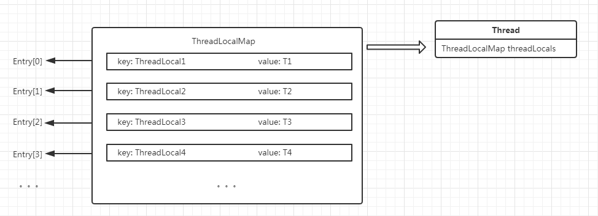

Thread类中有一个成员变量
```java
/* ThreadLocal values pertaining to this thread. This map is maintained
 * by the ThreadLocal class. */
ThreadLocal.ThreadLocalMap threadLocals = null;
```

而ThreadLocalMap是ThreadLocal类中一个静态内部类，它的底层数据结构是一个Entry数组（此Entry非彼Entry），Entry中的key就是一个ThreadLocal对象。

Entry的定义
```java
/**
 * ThreadLocalMap is a customized hash map suitable only for
 * maintaining thread local values. No operations are exported
 * outside of the ThreadLocal class. The class is package private to
 * allow declaration of fields in class Thread.  To help deal with
 * very large and long-lived usages, the hash table entries use
 * WeakReferences for keys. However, since reference queues are not
 * used, stale entries are guaranteed to be removed only when
 * the table starts running out of space.
 */
static class ThreadLocalMap {

    /**
     * The entries in this hash map extend WeakReference, using
     * its main ref field as the key (which is always a
     * ThreadLocal object).  Note that null keys (i.e. entry.get()
     * == null) mean that the key is no longer referenced, so the
     * entry can be expunged from table.  Such entries are referred to
     * as "stale entries" in the code that follows.
     */
    static class Entry extends WeakReference<ThreadLocal<?>> {
        /** The value associated with this ThreadLocal. */
        Object value;

        Entry(ThreadLocal<?> k, Object v) {
            super(k);
            value = v;
        }
    }

    // 省略部分代码
}
```

它继承了WeakReference。从构造方法中看出，Entry的key（ThreadLocal实例）作为WeakReference的reference。

> WeakReference用来标识对象是一个弱引用，只具有弱引用的对象拥有更短暂的生命周期。在没有任何strong reference（强引用）指向的时候，在垃圾收集器线程扫描它所管辖的内存区域的过程中，一旦发现了只具有弱引用的对象，不管当前内存空间足够与否，都会回收它的内存。不过，由于垃圾回收器是一个优先级很低的线程，因此不一定会很快发现那些只具有弱引用的对象。

继续看ThreadLocalMap的构造函数：
```java
/**
 * Construct a new map initially containing (firstKey, firstValue).
 * ThreadLocalMaps are constructed lazily, so we only create
 * one when we have at least one entry to put in it.
 */
ThreadLocalMap(ThreadLocal<?> firstKey, Object firstValue) {
    // 创建一个长度为16的Entry类型的数组
    // 并将它赋值给ThreadLocalMap的私有成员变量table
    table = new Entry[INITIAL_CAPACITY];
    // 计算Entry在数组中的下标
    int i = firstKey.threadLocalHashCode & (INITIAL_CAPACITY - 1);
    // 创建一个Entry实例，放到索引为i的位置
    table[i] = new Entry(firstKey, firstValue);
    // 设置数组中元素个数为1
    size = 1;
    // 设置数组扩容的负载系数为10
    setThreshold(INITIAL_CAPACITY);
}
```

ThreadLocal的get方法
```java
/**
 * Returns the value in the current thread's copy of this
 * thread-local variable.  If the variable has no value for the
 * current thread, it is first initialized to the value returned
 * by an invocation of the {@link #initialValue} method.
 *
 * @return the current thread's value of this thread-local
 */
public T get() {
    // 获取当前线程
    Thread t = Thread.currentThread();
    // 获取当前线程的成员变量threadLocals
    ThreadLocalMap map = getMap(t);
    if (map != null) {
        // 从table数组中获取对应的Entry对象
        ThreadLocalMap.Entry e = map.getEntry(this);
        if (e != null) {
            // 获取值并返回
            @SuppressWarnings("unchecked")
            T result = (T)e.value;
            return result;
        }
    }
    // 如果当前线程的成员变量threadLocals为null
    // 则进行初始化
    return setInitialValue();
}
```

ThreadLocal的setInitialValue方法
```java
/**
 * Variant of set() to establish initialValue. Used instead
 * of set() in case user has overridden the set() method.
 *
 * @return the initial value
 */
private T setInitialValue() {
    // 获得一个初始值，该方法被子类重写
    T value = initialValue();
    // 获取当前线程
    Thread t = Thread.currentThread();
    // 获取当前线程的成员变量threadLocals
    ThreadLocalMap map = getMap(t);
    if (map != null)
        // 如果threadLocals不为null
        // 则将当前的ThreadLocal对象，及其对应的值放入ThreadLocalMap中
        map.set(this, value);
    else
        // 如果threadLocals为null
        // 则创建一个ThreadLocalMap，并赋值给当前线程的成员变量threadLocals
        createMap(t, value);
    return value;
}
```

ThreadLocalMap的set方法
```java
/**
 * Set the value associated with key.
 *
 * @param key the thread local object
 * @param value the value to be set
 */
private void set(ThreadLocal<?> key, Object value) {


    // We don't use a fast path as with get() because it is at
    // least as common to use set() to create new entries as
    // it is to replace existing ones, in which case, a fast
    // path would fail more often than not.


    // 获取table
    Entry[] tab = table;
    // 获取table数组的长度
    int len = tab.length;
    // 计算key在数组中的位置
    int i = key.threadLocalHashCode & (len-1);


    // 循环遍历table数组，当数组元素为null时结束循环
    // nextIndex会循环获取数组下标
    // 线性探测法（是一种解决哈希碰撞的方法）
    // 如果当前槽没有元素，则直接插入元素
    // 否则，向后寻找第一个为null的槽，放置该元素
    for (Entry e = tab[i];
        e != null;
        e = tab[i = nextIndex(i, len)]) {
        ThreadLocal<?> k = e.get();


        if (k == key) {
            // 如果key与当前k相等，则直接用新值覆盖旧值，并结束方法
            e.value = value;
            return;
        }


        if (k == null) {
            // 如果找到一个k为null的槽，则执行替换操作（因为执行remove方法导致k为null）
            replaceStaleEntry(key, value, i);
            return;
        }
    }


    // 执行到这里表示找到一个为null的槽
    // 创建一个Entry，放到指定位置
    tab[i] = new Entry(key, value);
    // 元素个数加1
    int sz = ++size;
    // 执行清理操作，如果大小仍然达到负载系数则进行扩容
    if (!cleanSomeSlots(i, sz) && sz >= threshold)
        rehash();
}
```

ThreadLocalMap的replaceStaleEntry方法
```java
/**
 * Replace a stale entry encountered during a set operation
 * with an entry for the specified key.  The value passed in
 * the value parameter is stored in the entry, whether or not
 * an entry already exists for the specified key.
 *
 * As a side effect, this method expunges all stale entries in the
 * "run" containing the stale entry.  (A run is a sequence of entries
 * between two null slots.)
 *
 * @param  key the key
 * @param  value the value to be associated with key
 * @param  staleSlot index of the first stale entry encountered while
 *         searching for key.
 */
private void replaceStaleEntry(ThreadLocal<?> key, Object value,
                               int staleSlot) {
    Entry[] tab = table;
    int len = tab.length;
    Entry e;


    // Back up to check for prior stale entry in current run.
    // We clean out whole runs at a time to avoid continual
    // incremental rehashing due to garbage collector freeing
    // up refs in bunches (i.e., whenever the collector runs).
    // 将无效槽的索引赋值给slotToExpunge（待回收槽的索引）
    int slotToExpunge = staleSlot;
    for (int i = prevIndex(staleSlot, len);
         (e = tab[i]) != null;
         i = prevIndex(i, len))
        // 以staleSlot为起始，向前遍历，如果存在key为null的Entry
        if (e.get() == null)
            // 则把当前索引赋值给slotToExpunge变量
            slotToExpunge = i;


    // Find either the key or trailing null slot of run, whichever
    // occurs first
    // 以staleSlot为起始，向后遍历
    for (int i = nextIndex(staleSlot, len);
         (e = tab[i]) != null;
         i = nextIndex(i, len)) {
        ThreadLocal<?> k = e.get();


        // If we find key, then we need to swap it
        // with the stale entry to maintain hash table order.
        // The newly stale slot, or any other stale slot
        // encountered above it, can then be sent to expungeStaleEntry
        // to remove or rehash all of the other entries in run.
        // 如果当前k与传入的key相等
        if (k == key) {
            // 则直接用新值覆盖旧值
            e.value = value;


            // 将两个位置的Entry互换（将无效的槽后移）
            tab[i] = tab[staleSlot];
            tab[staleSlot] = e;


            // Start expunge at preceding stale entry if it exists
            // slotToExpunge与staleSlot相等时表示向前遍历时未找到k为null的元素
            if (slotToExpunge == staleSlot)
                // 将当前索引赋值给slotToExpunge变量
                // 因为前面的交换，i位置已经变成了无效的槽
                slotToExpunge = i;
            // 尝试清理
            cleanSomeSlots(expungeStaleEntry(slotToExpunge), len);
            return;
        }


        // If we didn't find stale entry on backward scan, the
        // first stale entry seen while scanning for key is the
        // first still present in the run.
        if (k == null && slotToExpunge == staleSlot)
            slotToExpunge = i;
    }


    // If key not found, put new entry in stale slot
    // 如果没有找到对应的key，则创建一个entry覆盖无效的槽
    tab[staleSlot].value = null;
    tab[staleSlot] = new Entry(key, value);


    // If there are any other stale entries in run, expunge them
    // 如果存在其它无效的槽，则执行清理
    if (slotToExpunge != staleSlot)
        cleanSomeSlots(expungeStaleEntry(slotToExpunge), len);
}
```

ThreadLocalMap的expungeStaleEntry方法
```java
/**
 * Expunge a stale entry by rehashing any possibly colliding entries
 * lying between staleSlot and the next null slot.  This also expunges
 * any other stale entries encountered before the trailing null.  See
 * Knuth, Section 6.4
 *
 * @param staleSlot index of slot known to have null key
 * @return the index of the next null slot after staleSlot
 * (all between staleSlot and this slot will have been checked
 * for expunging).
 */
// 删除无效的entry
private int expungeStaleEntry(int staleSlot) {
    Entry[] tab = table;
    int len = tab.length;


    // expunge entry at staleSlot
    // 删除无效槽上的entry
    tab[staleSlot].value = null;
    tab[staleSlot] = null;
    size--;


    // Rehash until we encounter null
    Entry e;
    int i;
    // 向后遍历数组
    for (i = nextIndex(staleSlot, len);
         (e = tab[i]) != null;
         i = nextIndex(i, len)) {
        ThreadLocal<?> k = e.get();
        // 如果k为null，则从数组中删除这个entry
        if (k == null) {
            e.value = null;
            tab[i] = null;
            size--;
        } else {
            // 如果k不为null，则计算它在数组中的位置
            int h = k.threadLocalHashCode & (len - 1);
            // 如果计算得到的位置与当前遍历到的位置不相等
            if (h != i) {
                // 把当前位置设置为null
                tab[i] = null;


                // Unlike Knuth 6.4 Algorithm R, we must scan until
                // null because multiple entries could have been stale.
                // 然后从h位置开始向后遍历，直到找到一个为null的位置（处理哈希碰撞）
                while (tab[h] != null)
                    h = nextIndex(h, len);
                // 然后把当前位置的entry，放到这个位置
                tab[h] = e;
            }
        }
    }
    // 从staleSlot向后遍历，返回一个为null的槽的索引
    return i;
}
```

ThreadLocalMap的cleanSomeSlots方法
```java
/**
 * Heuristically scan some cells looking for stale entries.
 * This is invoked when either a new element is added, or
 * another stale one has been expunged. It performs a
 * logarithmic number of scans, as a balance between no
 * scanning (fast but retains garbage) and a number of scans
 * proportional to number of elements, that would find all
 * garbage but would cause some insertions to take O(n) time.
 *
 * @param i a position known NOT to hold a stale entry. The
 * scan starts at the element after i.
 *
 * @param n scan control: {@code log2(n)} cells are scanned,
 * unless a stale entry is found, in which case
 * {@code log2(table.length)-1} additional cells are scanned.
 * When called from insertions, this parameter is the number
 * of elements, but when from replaceStaleEntry, it is the
 * table length. (Note: all this could be changed to be either
 * more or less aggressive by weighting n instead of just
 * using straight log n. But this version is simple, fast, and
 * seems to work well.)
 *
 * @return true if any stale entries have been removed.
 */
// 清理
// @param i 待清理槽的索引
// @param n 数组长度
private boolean cleanSomeSlots(int i, int n) {
    boolean removed = false;
    Entry[] tab = table;
    int len = tab.length;
    do {
        i = nextIndex(i, len);
        Entry e = tab[i];
        if (e != null && e.get() == null) {
            n = len;
            removed = true;
            // 删除无效的entry，如上
            i = expungeStaleEntry(i);
        }
    } while ( (n >>>= 1) != 0); // 8 4 2 1
    return removed;
}
```

ThreadLocalMap的resize方法
```java
/**
 * Double the capacity of the table.                         
 */
private void resize() {
    Entry[] oldTab = table;
    int oldLen = oldTab.length;
    int newLen = oldLen * 2;
    Entry[] newTab = new Entry[newLen];
    int count = 0;

    for (int j = 0; j < oldLen; ++j) {
        Entry e = oldTab[j];
        if (e != null) {
            ThreadLocal<?> k = e.get();
            if (k == null) {
                e.value = null; // Help the GC
            } else {
                int h = k.threadLocalHashCode & (newLen - 1);
                while (newTab[h] != null)
                    h = nextIndex(h, newLen);
                newTab[h] = e;
                count++;
            }
        }
    }

    setThreshold(newLen);
    size = count;
    table = newTab;
}
```

ThreadLocalMap的remove方法
```java
/**
 * Remove the entry for key.
 */
private void remove(ThreadLocal<?> key) {
    Entry[] tab = table;
    int len = tab.length;
    int i = key.threadLocalHashCode & (len-1);
    for (Entry e = tab[i];
            e != null;
            e = tab[i = nextIndex(i, len)]) {
        if (e.get() == key) {
            e.clear();
            expungeStaleEntry(i);
            return;
        }
    }
}
```