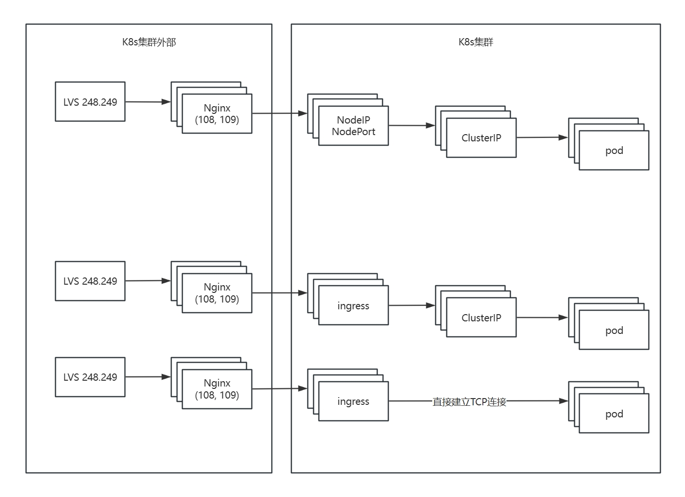

# K8s网络

## NodePort和ClusterIP
在Kubernetes中，`NodePort`和`ClusterIP`是两种不同类型的服务（Service），它们彼此之间有一些关系，但用于不同的用途：

1. **ClusterIP**：
   - 这是Kubernetes服务的默认类型。
   - 为服务分配一个集群内部的虚拟IP地址（`ClusterIP`）。
   - 只能在集群内部访问，即服务只能被同一集群中的其他Pod或节点访问。
   - 常用于微服务之间的内部通信。

2. **NodePort**：
   - `NodePort`是在`ClusterIP`基础上的一种扩展。
   - 除了暴露一个`ClusterIP`，还开放集群每个节点上的一个静态端口（范围通常在30000到32767之间），以便外部请求可以通过该端口访问服务。
   - 当你创建一个`NodePort`类型的服务时，它会自动创建一个对应的`ClusterIP`。
   - 外部用户可以通过以下方式访问服务：`<NodeIP>:<NodePort>`，其中`<NodeIP>`是任何集群节点的IP地址，`<NodePort>`是为该服务分配的端口号。
   - 适合需要简单外部访问的情况，但不提供负载均衡等高级功能。

3. **关系**：
   - `NodePort`依赖于`ClusterIP`。当你创建`NodePort`服务时，实际上创建了一个`ClusterIP`服务，并在每个节点上暴露了一个额外的端口。
   - `NodePort`的流量首先进入节点的指定端口，然后被转发到`ClusterIP`，再由`ClusterIP`将流量路由到后端Pod。

4. **使用场景对比**：
   - 使用`ClusterIP`时，服务只能内部访问，适合后台服务、数据库等内部组件。
   - 使用`NodePort`时，服务可被外部访问，适合需要直接从外部访问的简单应用，但配置和管理较为有限。

总结来说，`NodePort`服务是对`ClusterIP`的一种扩展，用于实现外部访问，而`ClusterIP`作为基础服务类型用于集群内部的服务发现和通信。这两者结合在一起，使得服务既能被集群内部访问，也能在必要时通过节点端口被外部访问。

## kube-proxy
在 Kubernetes 中，kube-proxy 是一个核心网络组件，负责实现集群内服务的负载均衡和网络流量路由。它是实现 Kubernetes Service 抽象的关键模块，确保 Pod 之间的通信和外部流量的正确分发。

在iptables/IPVS 模式下，kube-proxy实际不自己处理流量，流量完全由内核处理。kube-proxy只监听service的变化，并更新规则。这样既避免了单点的性能瓶颈，又提高了可靠性（因为流量无需经过 kube-proxy 进程，并且，即使 kube-proxy 进程崩溃，已有的网络规则仍能正常工作）。

### **kube-proxy 的核心作用**
1. **服务抽象**：  
   将 Service 的虚拟 IP（Cluster IP）和端口映射到后端 Pod 的实际 IP 和端口。
2. **负载均衡**：  
   在多个 Pod 之间分配流量，支持多种负载均衡策略（如轮询、会话亲和性）。
3. **动态规则更新**：  
   监听 Kubernetes API Server，实时更新网络规则以反映 Pod 的变化（扩缩容、重启等）。

### **kube-proxy 的三种工作模式**
kube-proxy 支持三种不同的实现模式，每种模式底层技术不同，适用于不同场景：

#### **1. Userspace 模式（已弃用）**
- **原理**：  
  kube-proxy 在用户空间启动一个代理进程，监听 Service 的端口，将流量转发到后端 Pod。
- **流程**：  
  1. 用户请求到达 Service 的 Cluster IP 和端口。
  2. kube-proxy 的代理进程接收请求。
  3. 代理进程根据负载均衡策略（如轮询）选择一个 Pod，建立连接并转发流量。
- **缺点**：  
  - 性能差：流量需经过用户空间和内核空间的多次复制。
  - 单点瓶颈：代理进程可能成为性能瓶颈。

#### **2. Iptables 模式（默认模式）**
- **原理**：  
  直接利用 Linux 内核的 **iptables** 规则实现流量转发，无需用户空间代理。
- **流程**：  
  1. kube-proxy 监听 Service 和 Endpoints 的变化。
  2. 生成 iptables 规则，将 Service 的 Cluster IP 和端口映射到 Pod IP 和端口。
  3. 流量直接由内核的 iptables 处理，无需经过 kube-proxy 进程。
- **优点**：  
  - 性能高：流量在内核层直接转发。
  - 无单点瓶颈。
- **缺点**：  
  - 规则数量随 Service 和 Pod 数量增长，可能影响性能。
  - 负载均衡策略有限（仅支持随机或轮询）。

#### **3. IPVS 模式（推荐用于生产环境）**
- **原理**：  
  利用 Linux 内核的 **IPVS**（IP Virtual Server）实现流量分发，专为负载均衡设计。
- **流程**：  
  1. kube-proxy 将 Service 映射到 IPVS 虚拟服务器。
  2. IPVS 在内核空间根据调度算法（如轮询、加权轮询、最小连接等）分发流量。
- **优点**：  
  - 高性能：IPVS 专为负载均衡优化，支持大规模集群。
  - 丰富的调度算法（10+ 种）。
  - 规则管理效率更高。
- **缺点**：  
  - 需要 Linux 内核支持 IPVS 模块（需提前加载 `ip_vs`、`ip_vs_rr` 等内核模块）。

### 查看正在运行的kube-proxy
```
[kuaidi@k8s-dev-master ~]$ sudo kubectl get pods -n kube-system -l k8s-app=kube-proxy
NAME               READY   STATUS    RESTARTS   AGE
kube-proxy-4qrb5   1/1     Running   0          99d
kube-proxy-7qjb5   1/1     Running   0          99d
```

### 查看某个kube-proxy Pod的日志
```
[kuaidi@k8s-dev-master ~]$ sudo kubectl logs kube-proxy-4qrb5 -n kube-system
W0120 06:01:06.100089       1 server_others.go:559] Unknown proxy mode "", assuming iptables proxy
I0120 06:01:06.175421       1 node.go:136] Successfully retrieved node IP: 10.240.1.174
I0120 06:01:06.175463       1 server_others.go:186] Using iptables Proxier.
I0120 06:01:06.175737       1 server.go:583] Version: v1.18.6
I0120 06:01:06.176197       1 conntrack.go:52] Setting nf_conntrack_max to 1048576
I0120 06:01:06.176513       1 config.go:315] Starting service config controller
I0120 06:01:06.176537       1 shared_informer.go:223] Waiting for caches to sync for service config
I0120 06:01:06.176614       1 config.go:133] Starting endpoints config controller
I0120 06:01:06.176647       1 shared_informer.go:223] Waiting for caches to sync for endpoints config
I0120 06:01:06.296125       1 shared_informer.go:230] Caches are synced for endpoints config 
I0120 06:01:06.476704       1 shared_informer.go:230] Caches are synced for service config 
I0206 07:13:55.047441       1 trace.go:116] Trace[950201627]: "iptables restore" (started: 2025-02-06 07:13:46.707803522 +0000 UTC m=+1473161.549005668) (total time: 8.294077077s):
Trace[950201627]: [8.294077077s] [8.294077077s] END
I0424 08:33:00.497514       1 trace.go:116] Trace[643817512]: "iptables restore" (started: 2025-04-24 08:32:58.203590394 +0000 UTC m=+8130713.044792521) (total time: 2.293877396s):
Trace[643817512]: [2.293877396s] [2.293877396s] END
I0427 08:14:17.112121       1 trace.go:116] Trace[1708345795]: "iptables restore" (started: 2025-04-27 08:14:09.598401564 +0000 UTC m=+8388784.439603713) (total time: 7.513679253s):
Trace[1708345795]: [7.513679253s] [7.513679253s] END
```

### 查看与某个特定服务有关的规则
```
[kuaidi@k8s-dev-master ~]$ sudo iptables -t nat -L KUBE-SERVICES -v -n | head -2
Chain KUBE-SERVICES (2 references)
 pkts bytes target     prot opt in     out     source               destination         
[kuaidi@k8s-dev-master ~]$ sudo iptables -t nat -L KUBE-SERVICES -v -n | grep shipper
    0     0 KUBE-MARK-MASQ  tcp  --  *      *      !10.244.0.0/16        10.110.149.161       /* default/test-shipper:test-shipper cluster IP */ tcp dpt:8081
    0     0 KUBE-SVC-RMROYAKF7GAU3HYE  tcp  --  *      *       0.0.0.0/0            10.110.149.161       /* default/test-shipper:test-shipper cluster IP */ tcp dpt:8081
```

### **kube-proxy 与 ClusterIP 的关系**
#### **ClusterIP Service 的作用**
- 为 Service 分配一个**集群内部虚拟 IP（Cluster IP）**，使得集群内的 Pod 可以通过该 IP 和端口访问服务。
- 例如：一个前端 Pod 通过 `http://10.110.149.161:8081` 访问后端服务。

#### **kube-proxy 的职责**
1. **创建 ClusterIP 规则**：  
   当创建 `ClusterIP` 类型的 Service 时，kube-proxy 会生成 iptables/IPVS 规则，将发往 `ClusterIP:Port` 的流量转发到后端 Pod。
2. **动态更新规则**：  
   当 Pod 扩缩容或重启时，kube-proxy 更新规则以反映最新的 Endpoints。

#### **示例流程**
```plaintext
Pod A 请求 ClusterIP:8081
  │
  ▼
kube-proxy 维护的 iptables/IPVS 规则
  │
  ▼
负载均衡到 Pod X:8081、Pod Y:8081、Pod Z:8081
```

### **kube-proxy 与 NodePort 的关系**
#### **NodePort Service 的作用**
- 在 ClusterIP 的基础上，**在每个节点上开放一个静态端口**（如 30101），允许外部通过 `<NodeIP>:<NodePort>` 访问服务。
- 例如：用户通过 `http://<NodeIP>:30101` 访问集群内的服务。

#### **kube-proxy 的职责**
1. **创建 NodePort 规则**：  
   kube-proxy 会生成额外的 iptables/IPVS 规则，将到达 `<NodeIP>:30101` 的流量转发到 `ClusterIP:30101`，再进一步分发到 Pod。
2. **统一负载均衡**：  
   NodePort 的流量最终仍然通过 ClusterIP 的负载均衡机制分发到 Pod。

#### **示例流程**
```plaintext
外部请求 NodeIP:30101
  │
  ▼
kube-proxy 维护的 iptables/IPVS 规则（将 NodePort 映射到 ClusterIP）
  │
  ▼
ClusterIP:30101 的负载均衡规则
  │
  ▼
分发到 Pod X:30101、Pod Y:30101、Pod Z:30101
```

## Ingress

**Ingress** 不是 Service 类型，而是一个独立的 API 对象，用于定义**外部访问的 HTTP/HTTPS 路由规则**。它的核心功能是：
- **七层（应用层）路由**：基于域名、路径等规则将流量分发到不同的 Service。
- **TLS 终止**：支持 HTTPS 证书管理。
- **负载均衡**：可与 Ingress 控制器（如 Nginx、Traefik）结合，实现高级流量管理。

Ingress 本身不处理流量，需要配合 Ingress 控制器（如 Nginx Ingress Controller）实现流量路由。Ingress 控制器通常以 Pod 形式运行，并通过 NodePort 或 LoadBalancer 类型的 Service 暴露自身。


```
[kuaidi@k8s-dev-master ~]$ sudo kubectl get service --all-namespaces
...
[kuaidi@k8s-dev-master ~]$ sudo kubectl describe service ingress-nginx -n ingress-nginx
Name:                     ingress-nginx
Namespace:                ingress-nginx
Labels:                   app.kubernetes.io/name=ingress-nginx
                          app.kubernetes.io/part-of=ingress-nginx
Annotations:              Selector:  app.kubernetes.io/name=ingress-nginx,app.kubernetes.io/part-of=ingress-nginx
Type:                     LoadBalancer
IP:                       10.100.29.33
Port:                     http  80/TCP
TargetPort:               http/TCP
NodePort:                 http  31930/TCP
Endpoints:                10.240.1.171:80,10.240.1.172:80,10.240.1.173:80 + 13 more...
Port:                     https  443/TCP
TargetPort:               https/TCP
NodePort:                 https  30319/TCP
Endpoints:                10.240.1.171:443,10.240.1.172:443,10.240.1.173:443 + 13 more...
Session Affinity:         None
External Traffic Policy:  Local
HealthCheck NodePort:     30378
Events:                   <none>
```
从以上输出的Endpoints可以看出，ingress-nginx service包含了多个节点的IP地址和端口号，每一个IP和端口对应一个nginx服务。ingress控制器会根据ingress规则自动生成反向代理（如 Nginx）的配置文件。当规则变化时，自动更新配置并重新加载代理（如 nginx -s reload）。当流量到达时会根据规则路由到后端 Service。

将ingress的host映射到Endpoints中的任何一个IP后，就可以通过host访问后端Service。除此之外，还可以通过NodePort访问后端Service，例如：10.240.1.171:31930。注意，使用`<NodeIP>:<NodePort>`进行访问时需要确保请求的主机头与Ingress资源中定义的主机一致，即，请求头中必须增加`Host: your.domain.com`。

当通过ingress向pod发起一个请求时，虽然流量需要通过ClusterIP到达pod，但实际是ingress控制器与pod之间建立了TCP长连接。

### 进入 Ingress 控制器 Pod 的 Shell，查看生成的配置文件
```shell
[kuaidi@k8s-dev-master ~]$ sudo kubectl get pod -n ingress-nginx
NAME                                        READY   STATUS    RESTARTS   AGE
nginx-ingress-controller-79bcd678b4-l9k2m   1/1     Running   0          83d
nginx-ingress-controller-79bcd678b4-24xl2   1/1     Running   0          83d
nginx-ingress-controller-79bcd678b4-2qf2l   1/1     Running   0          46h
[kuaidi@k8s-dev-master ~]$ sudo kubectl exec -it nginx-ingress-controller-79bcd678b4-l9k2m -n ingress-nginx -- cat /etc/nginx/nginx.conf
```

## 现生产环境网络拓扑图
