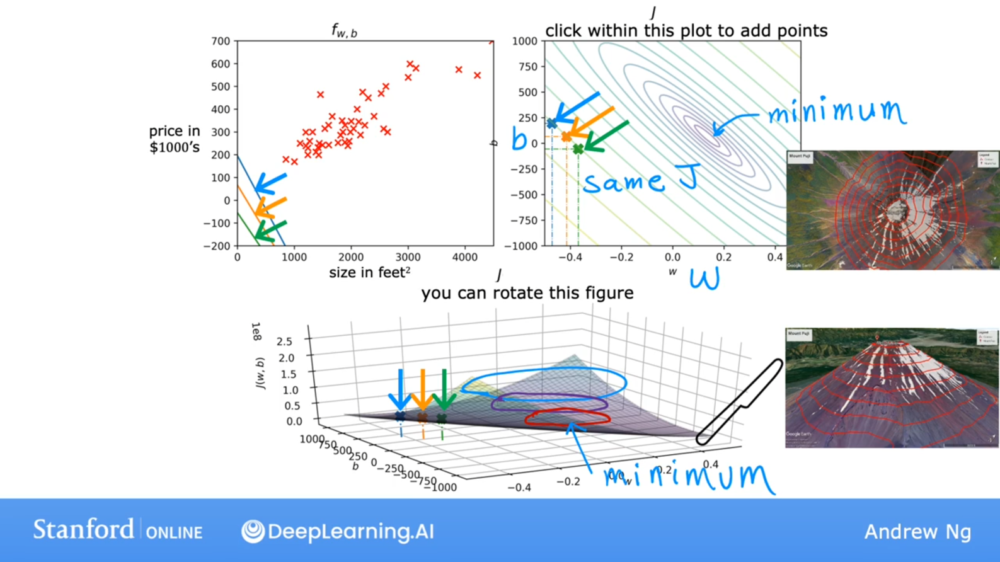

## 代价函数的直观理解
**Model**：$f_w,_b(x)=wx + b$

$w,b$：**parameters**，也被称为系数（coefficients）或权重（weights）

对于线性回归，我们需要做的就是选择参数$w$和$b$的值，以便函数$f$获得的直线以某种方式很好地拟合数据。即使得$wx^{(i)}+b$的预测值$\hat{y}$接近真实目标$y^{(i)}$。

如何衡量一条直线与训练数据的拟合程度，为此，我们将构建一个成本函数（**cost function**）

$J(w,b)=\frac{1}{2m}\displaystyle\sum_{i=1}^m(f_w._b(x^{(i)}) - y^{(i)})^2$

**goal**：线性回归会尝试找到$w$和$b$的值，然后使得$J(w,b)$尽可能小（$\displaystyle\min_{w,b}J(w,b)$）。

$f_w(x)$与$J(w)$的关系图如下：
-and-J(w).png)

上述过程称为线性回归模型的最小二乘“参数估计”（parameter estimation）。

基于均方误差（亦称平方损失）最小化来进行模型求解的方法称为“最小二乘法”（least square method）。在线性回归中，最小二乘法就是试图找到一条直线，使所有样本到直线上的欧氏距离之和最小。

## 可视化代价函数

上图底部是成本函数$J$的3D表面图。右上方是与底部完全相同的成本函数的等值线图（等值线图是可视化3D成本函数J的一种便捷方式，但在某种程度上，它只是以2D形式绘制），这些椭圆形是由3D表面上处于相同高度的点构成的，换句话说，每一个椭圆形是对于成本函数$J$具有相同值的点集。

等值线图中蓝色、绿色、橙色的点，表示了不同$w,b$的组合，使得成本函数$J$都具有相同的值。在左上图中可以看到这三个点对应于不同的函数$f(x)$，在这种情况下，这三个点对于预测$\hat{y}$都非常糟糕。

成本函数$J$的最小值在这个椭圆的中心点（等值线图中minimum标识的位置）