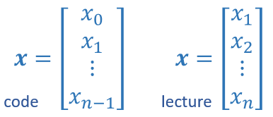

# 多类特征
**multiple linear regression**
$$
\begin{align*}
f_{\overrightarrow{w},b}\overrightarrow{x}&=\overrightarrow{w}\cdot\overrightarrow{x} + b
\\
&=w_1x_1+w_2x_2+w_3x_3+...+w_nx_n+b
\end{align*}
$$

也可以写成：$f_{\mathbf{w},b}(\mathbf{x}) = \mathbf{w} \cdot \mathbf{x}+b$，其中向量$\mathbf{w}$和$\mathbf{x}$使用小写加粗的字母表示。

# 向量化
## 向量
The number of elements in the array is often referred to as the dimension though mathematicians may prefer rank.

数组中元素的数量通常被描述为维数，尽管数学家可能更喜欢描述为秩。下图所示的向量具有$n$维。

## NumPy Arrays
NumPy's basic data structure is an indexable, n-dimensional array containing elements of the same type.

NumPy的基本数据结构是一个可索引的n维数组，其中包含相同类型的元素。在上一节中‘dimension’表示向量中的元素个数，而这里，‘dimension’表示数组中的索引数量。

关于NumPy的使用练习，可以参考：C1_W2_Lab01_Python_Numpy_Vectorization_Soln.ipynb