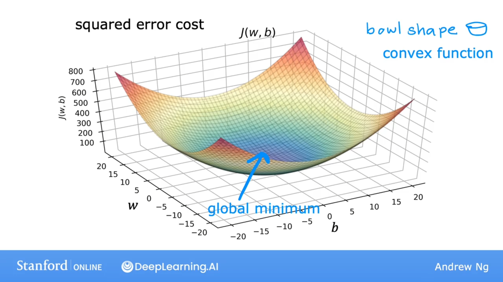

梯度下降是一种可用于尝试最小化任何函数的算法，例如具有两个以上参数的模型的成本函数：$J(w_1,w_2,...,w_n,b)$，那么我们的目标就是在参数$w_1$到$w_n$和$b$上最小化$J$（$\displaystyle\min_{w_1,...,w_n,b}J(w_1,w_2,...,w_n,b)$）

## 梯度下降算法
$$
w=w-\alpha\frac{\partial J(w,b)}{\partial w}
$$
$$
b=b-\alpha\frac{\partial J(w,b)}{\partial b}
$$

$\alpha$：Learning rate，通常是0到1之间的一个小正数。alpha所做的是控制下坡步幅（正比关系）

$\frac{\partial J(w,b)}{\partial w}$：Derivative，朝哪个方向迈出一小步。

## 梯度下降的直观理解

现在假设$b$为0，并且模型只有一个参数$w$，这时让我们看看梯度下降对函数$J(w)$做了什么。

梯度下降做的是将$w$更新为$w-\alpha\frac{\partial J(w)}{\partial w}$。

$\frac{\partial J(w)}{\partial w}$ 导数的含义：考虑这一点上的导数的方法是画一条直线，这是一条在该点与该曲线相交的直线，这条直线的斜率就是函数$J(w)$在这一点的导数。

当切线指向右上方时，斜率为正，这意味着该导数是正数，又因为$\alpha$始终为正数，那么$w=w-\alpha\cdot(positive\ number)$，会得到$w$的一个更小的新值。

这意味着在左上的坐标图中，我们正在向左移动，如果我们的目标是降低成本$J$，这是正确的做法。

当切线指向右下方时，斜率为负，这意味着该导数是负数，同理，$w=w-\alpha\cdot(positive\ number)$，会得到$w$的一个更大的新值。

这意味着在左下的坐标图中，我们正在向右移动，同样，看起来梯度下降正在做一些合理的事情，让我们更接近$J(w)$的最小值。

## 学习率

如果学习率太小，那么梯度下降会起作用，但是速度会很慢，它需要很多步才能接近最小值。

如果学习率太大，则会引起Overshoot，并且可能永远不会达到最小值。

如果你已经处于局部最小值，梯度下降会使$w$保持不变。

当我们运行梯度下降时，最终我们会采取非常小的步骤，直到最终达到局部最小值。因为当我们接近局部最小值时，导数会自动变小。

## 线性回归中的梯度下降

上图中分别展示了成本函数$J$关于$w和b$的导数的表达式，下面是$\frac{\partial J(w,b)}{\partial w}=\frac{1}{m}\displaystyle\sum_{i=1}^m(f_{(w,b)}(x) - y)x$推导过程，$\frac{\partial J(w,b)}{\partial b}$的推导过程同理。

$$
\begin{align*}
J(w,b)&=\frac{1}{2m}\displaystyle\sum_{i=1}^m(f_w._b(x) - y)^2
\\
&=\frac{1}{2m}\displaystyle\sum_{i=1}^m(wx + b - y)^2
\\
\partial J&=\frac{1}{2m}\displaystyle\sum_{i=1}^m((w + \partial w)x + b - y)^2 - (wx + b - y)^2
\\
&=\frac{1}{2m}\displaystyle\sum_{i=1}^m(wx + \partial wx + b - y + wx + b - y)(wx + \partial wx + b - y - wx - b + y)
\\
&=\frac{1}{2m}\displaystyle\sum_{i=1}^m(2wx + \partial wx + 2b - 2y)(\partial wx)
\\
&=\frac{1}{2m}\displaystyle\sum_{i=1}^m(2wx + 2b - 2y)(\partial wx) + (\partial wx)^2
\\
&=\frac{1}{2m}\displaystyle\sum_{i=1}^m(2wx + 2b - 2y)(\partial wx)
\\
&=\frac{1}{2m}\displaystyle\sum_{i=1}^m(wx + b - y)2x\partial w
\\
\frac{\partial J}{\partial w}&=\frac{1}{m}\displaystyle\sum_{i=1}^m(wx + b - y)x
\\
&=\frac{1}{m}\displaystyle\sum_{i=1}^m(f_{(w,b)}(x) - y)x
\\
\frac{\partial J(w,b)}{\partial w}&=\frac{1}{m}\displaystyle\sum_{i=1}^m(f_{(w,b)}(x) - y)x
\end{align*}
$$

线性回归的平方误差成本函数永远不会有多个局部最小值，它具有单一的全局最小值，因此这类成本函数是一个凸函数。在凸函数上实现梯度下降时，一个很好的特性是只要选择适当的学习率，它总是会收敛到全局最小值。