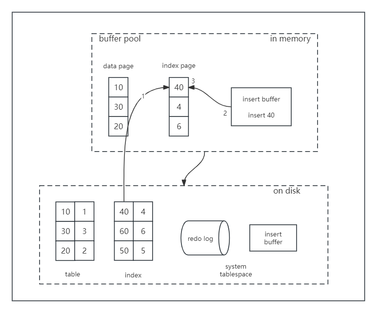

# 更改缓冲区
更改缓冲区（缓冲池的一部分）是一种特殊的数据结构，当二级索引页不在缓冲池中时，它会缓存对二级索引页的更改，稍后在其它读取操作将数据页加载到缓冲池时再进行合并。

与聚集索引不同，二级索引通常是非唯一的，并且以相对随机的顺序插入二级索引，这使得删除和更新可能会影响索引树中不相邻的二级索引页。而更改缓冲区能够在稍后的其他操作将受影响的页面读入缓冲池时合并缓存的更改，以此来避免大量随机访问I/O。

情况一：要修改的数据已被缓存到缓冲池中
1. 直接修改缓冲池中的页，一次内存操作；
2. 写入redo log，一次顺序写操作。

以上是否会出现一致性问题？不会！
1. 读取会命中缓冲池中的页。
2. 缓冲池LRU数据淘汰，会将“脏页”刷回磁盘。（定期刷磁盘，而不是每次刷磁盘，能够降低磁盘IO，提升MySql的性能。）
3. 数据库异常崩溃，能够从redo log中恢复数据。

情况二：要修改的数据不在缓冲池中
1. 先要把数据从磁盘加载到缓冲池，一次磁盘随机读操作；
2. 修改缓冲池中的页，一次内存操作；
3. 写入redo log，一次顺序写操作。

此时多了一次磁盘I/O。

在MySql5.5版本之前，写缓冲叫插入缓冲，只针对insert做了优化。5.5及之后的版本对delete和update同样有效，叫做写缓冲。

它是一种应用在**非唯一普通索引页**不在缓冲池中，在对页进行写操作时，并不会立刻将磁盘页加载到缓冲池，而仅仅记录缓冲变更，等未来数据被读取时，再将数据合并恢复到缓冲池中的技术。写缓冲的目的是降低写操作的磁盘I/O，提升数据库性能。

在加入写缓冲后，上文“情况二”的流程变为：
1. 在写缓冲中记录这个操作，一次内存操作；
2. 写入redo log，一次磁盘顺序写操作。

是否会出现一致性问题？不会！
1. 数据库异常崩溃，能够从redo log中恢复数据；
2. 写缓冲不只是一个内存结构，它也会被定期刷盘到写缓冲系统表空间；
3. 数据读取时，将数据合并到缓冲池。

不妨设，稍后的一个时间，有请求查询索引页40的数据。

此时的流程如序号1-3：
1. 载入索引页，缓冲池未命中，这次磁盘IO不可避免；
2. 从写缓冲读取相关信息；
3. 恢复索引页，放到缓冲池LRU里。

## 相关参数设置
1. innodb_change_buffer_max_size：写缓冲的大小，占整个缓冲池的比例，默认值是25%，最大值是50%。
2. innodb_change_buffering：配置哪些操作启用写缓冲，inserts、deletes、purges、changes、all、none。