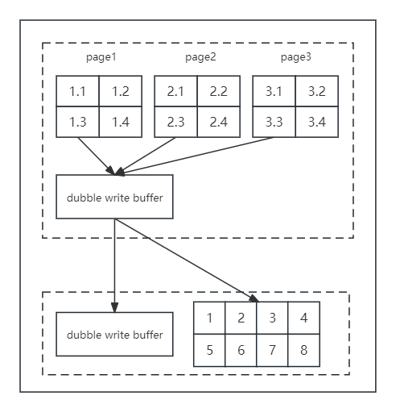

# 双写缓冲区
MySql的buffer一页的大小是16K，文件系统一页的大小是4K，也就是说，MySql将buffer中一页数据刷入磁盘，要写4个文件系统里的页。

但是，这个操作并非原子操作，如果执行到一半断电，则会出现“页数据损坏”。

解决页数据损坏，很容易想到的方法是，能有一个“副本”，对原来的页进行还原，这个存储“副本”的地方，就是 double write buffer。

double write buffer 分为内存和磁盘的两层架构。

如上图，当有页数据刷盘时：
1. 页数据先memcopy到DWB的内存里；
2. 从DWB的内存里，先把数据刷到DWB的磁盘上（doublewrite buffer系统表空间）；
3. 再一次从DWB的内存里，把数据刷到数据磁盘上。

假设步骤2掉电，此时保证了数据的完整性。  
假设步骤3掉电，DWB磁盘中存储着完整的数据。

## 相关参数设置
1. innodb_dblwr_pages_written：记录写入DWB中页的数量。
2. innodb_dblwr_writes：记录DWB写操作的次数。
3. innodb_doublewrite：是否开启了二次写。