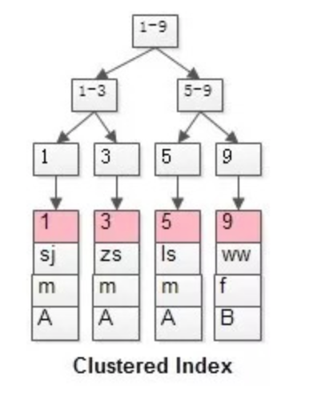

# InnoDB的七种锁
1. 共享/排他锁（Shared and Exclusive Locks）
2. 记录锁（Record Locks）
3. 间隙锁（Gap Locks）
4. 临键锁（Next-key Locks）
5. 自增锁（Auto-inc Locks）
6. 意向锁（Intention Locks）
7. 插入意向锁（Insert Intention Locks）

MySQL的InnoDB的细粒度行锁，是它最吸引人的特性之一。但是查询没有命中索引，将退化为表锁。InnoDB的细粒度锁是实现在索引之上的。

InnoDB有两类索引：
* 聚集索引（Clustered Index）
* 普通索引（Secondary Index）

InnoDB的每个表都有聚集索引：
1. 如果表定义了PK，那么PK就是聚集索引；
2. 如果没有定义PK，则将第一个非空unique列作为聚集索引；
3. 否则，InnoDB会创建一个6字节row-id的隐藏聚集索引。

索引的数据结构是B+树：
1. 在索引结构中，非叶子节点存储key，叶子节点存储value；
2. 聚集索引，叶子节点存储行记录；所以，InnoDB索引和记录都存储在叶子节点中，而MyISAM的索引和记录是分开存储的。
3. 普通索引，叶子节点存储了PK的值；所以，在使用InnoDB的普通索引时，实际上会扫描两遍：第一遍，由普通索引找到PK；第二遍，由PK找到行记录；

例如，有表：  
t(id PK, name KEY, sex);  
隔离级别RR，表中有四条记录：  
1, zhangsan, m  
3, lisi, m  
5, wangwu, m  
9, zeiliu, m

可以看到：  
第一幅图，id PK的聚集索引，叶子节点存储了所有的行记录；  
第二幅图，name KEY的普通索引，叶子节点存储了PK的值。

对于：`select * from t where name = 'zeiliu';`
1. 先在name的普通索引上查询到PK=9；
2. 再在聚集索引上查询到行记录。

# 共享/排它锁
1. 事务拿到某一行记录的共享S锁，才可以读取这一行；
2. 事务拿到某一行记录的排它X锁，才可以修改或者删除这一行；

共享/排它锁的潜在问题是，不能充分的并行，解决思路是**数据多版本**。

# 记录锁（Record Locks）
记录锁，它封锁索引记录，例如：`select * from t where id = 1 for update;`，它会在id=1的索引上加锁，以阻止其他事务更新、删除id=1的这一行。而`select * from t where id = 1;`，则是快照读，不会加锁。

# 间隙锁（Gap Locks）
间隙锁，它封锁索引记录中的间隔，或者第一条索引记录之前的范围，又或者最后一条记录之后的范围。

依然以上面的表为例：`select * from t where id between 8 and 15 for update;`这个SQL会封锁区间，例如阻止id=10的记录插入。为什么会阻止id=10的记录插入？如果能够插入成功，同一个事务执行相同的SQL时，会发现结果集多出了一条记录，即幻读。**间隙锁的主要目的，就是为了防止其它事务在间隔中插入数据**，以导致不可重复读。**如果把隔离级别降到RC，间隙锁则会自动失效。**

# 临键锁（Next-key Locks）
临键锁，是记录锁和间隙锁的组合，它的封锁范围，既包含索引记录，又包含索引区间。更具体的，临键锁会封锁索引记录本身，以及索引记录之前的区间。如果一个会话占有了索引记录R的共享或排他锁，其他会话不能立刻在R之前的区间插入新的索引记录。

依然以上表为例，PK上的潜在临键锁为：  
(-infinity, 1]  
(1, 3]  
(3, 5]  
(5, 9]  
(9, +infinity]

临键锁的主要目的，也是为了避免幻读（Phantom Read）。**如果把事务的隔离级别降级为RC，临键锁则也会失效。**

# 自增锁
MySQL，InnoDB，默认隔离级别（RR），假设有数据表：  
t(id AUTO_INCREMENT, name);  
数据表中有数据：  
1, zhangsan  
2, lisi  
3, wangwu

事务A先执行，还未提交：  
`insert into t (name) values (xxx);`  
事务B后执行：  
`insert into t (name) values (xxx);`

问：事务B会不会被阻塞？
1. 事务A先执行insert，得到一条id为4的记录，此时事务未提交；
2. 事务B执行insert，假设不会被阻塞，得到一条id为5的记录，此时并未有什么不妥；
3. 事务A继续insert，得到一条id为6的记录；
4. 然后，事务A再select * from t where id >= 4，得到的结果是id为4和6的记录（在RR的隔离级别下，不可能读取到还未提交事务生成的数据）

id明明是自增长的，事务A却读出了id不连续的记录。

自增锁是一种特殊的表级别锁（table-level lock），专门针对事务插入AUTO_INCREMENT类型的列。最简单的情况，如果一个事务正在往表中插入记录，所有其他事务的插入必须等待，以便第一个事务插入的行，是连续的主键值。

官方说明：An AUTO-INC lock is a special table-level lock taken by transactions inserting into tables with AUTO_INCREMENT columns. In the simplest case, if one transaction is inserting values into the table, any other transactions must wait to do their own inserts into that table, so that rows inserted by the first transaction receive consecutive primary key values.

相关参数设置：  
innodb_autoinc_lock_mode：该参数控制着向有auto_increment列的表插入数据时，相关锁的行为；通过对它的设置可以达到性能与安全的平衡。

首先insert大致上可以分成三类：
1. insert-like语句：在表中生产新行的所有语句，包括insert、insert...select、replace、replace...select和load_data。包括simple-insert、bulk-insert、mixed-insert。
2. simple insert，如：insert into t (name) values ('test')。在最初处理语句时，可以预先确定要插入的行数的语句。 这包括单行和多行的insert，或者是没有嵌套字查询的replace，但不包括insert ... on duplicate key update。
3. bulk insert，如：load data、insert into ... select ... from ...。预先不知道要插入的行数（以及所需的自动增量值的数量）的语句。这包括 INSERT ... SELECT, REPLACE ... SELECT和LOAD DATA语句，但不包括 plain INSERT。处理每行时，InnoDB一次分配一个新值给自增列。
4. mixed insert，如：insert into t (id, name) values (1,'a'), (NULL,'b'), (5,'c'), (NULL,'d')。为某些行（不是全部）指定了自增列的值。另一种类型的混合模式插入是insert ... on duplicate key update，最坏的情况是每一个insert后都跟了一个update，其中为自增列分配的值可能会或可能不会在更新阶段使用。

innodb_autoinc_lock_mode有三个取值：
- 0表示traditional，在这一模式下，所有的insert（insert-like）语句都会在语句开始的时候得到一个表级的AUTO-INC锁（在具有auto_increment列的表中），在语句结束的时候才释放这把锁，（注意，这里说的是语句级而不是事务级的，一个事务可能包涵有一个或多个语句）以确保给定的语句序列是以可预测和可重复的顺序分配自动递增值，并且这些递增值是连续的。这也就保证了insert语句在复制到slave的时候还能生成和master那边一样的值（它保证了基于语句复制的安全）。由于在这种模式下auto_inc锁一直要保持到语句的结束，所以这个就影响到了并发的插入。
- 1（默认值）表示consecutive，在这一模式下，“批量插入”（bulk insert）使用特殊的AUTO-INC表级锁并持有它直到语句结束。这一模式下对simple insert做了优化，由于simple insert一次性插入的行数可以立马得到确定，所以mysql可以通过在互斥锁（一种轻量级锁）的控制下获得所需数量的自增值来避免表级锁；除非自增锁被其他事务持有，否则不会使用表级别的锁。如果一个事务持有了自增锁，一个simple insert正在等待自增锁，那这个simple insert就像是一个bulk insert。这一模式下任何“INSERT-like”语句分配的所有自动递增值都是连续的，并且操作对于基于语句的复制是安全的。
- 2表示interleaved，由于这个模式下已经没有了auto_inc锁，所以这个模式下的性能是最好的；但是它也有一个问题，就是对于同一个语句来说它所得到的auto_incremant值可能不是连续的。并且在基于语句的复制或者恢复的场景中，它并不安全。

如果使用基于语句的复制，innodb_autoinc_lock_mode应该被设置成0或1。如果你的二进制文件格式是mixed | row 那么这三个值中的任何一个对于你来说都是复制安全的。

> 参考：https://dev.mysql.com/doc/refman/5.7/en/innodb-auto-increment-handling.html#innodb-auto-increment-lock-modes

# 意向锁
InnoDB支持多粒度锁（multiple granularity locking），它允许行级锁与表级锁共存，实际应用中，InnoDB使用的是意向锁。

意向锁是指，未来的某个时刻，事务可能要加共享/排它锁了，先提前声明一个意向。

意向锁有这样一些特点：
1. 首先，意向锁，是一个表级别的锁（table-level locking）;
2. 意向锁分为：
	* 意向共享锁（intention shared lock, IS），它预示着，事务有意向对表中的某些行加共享锁
	* 意向排它锁（intention exclusive lock, IX），它预示着，事务有意向对表中的某些行加排它锁

    🌰：  
    `select ... lock in share mode`，要设置IS锁；  
    `select ... for update`，要设置IX锁；  

3. 意向锁协议（intention locking protocol）并不复杂：
	* 事务要获得某些行的S锁，必须先获得表的IS锁
	* 事务要获得某些行的X锁，必须先获得表的IX锁

LOCK | IS | IX | S | X
--   | -  | -  | - | -
IS   | √  | √  | √ | x 
IX   | √  | √  | x | x
S    | √  | x  | √ | x
X    | x  | x  | x | x

# 插入意向锁
对已有数据行的修改与删除，必须加强互斥锁X锁，那对于数据的插入，是否还需要加这么强的锁，来实施互斥呢？插入意向锁，孕育而生。

插入意向锁，是间隙锁(Gap Locks)的一种（所以，也是实施在索引上的），它是专门针对insert操作的。

它的玩法是：多个事务，在同一个索引，同一个范围区间插入记录时，如果插入的位置不冲突，不会阻塞彼此。

官方说明：Insert Intention Lock signals the intent to insert in such a way that multiple transactions inserting into the same index gap need not wait for each other if they are not inserting at the same position within the gap.

在MySQL，InnoDB，RR下：  
t(id unique PK, name);  
数据表中有数据：  
10, shenjian  
20, zhangsan  
30, lisi

事务A先执行，在10与20两条记录中插入了一行，还未提交：`insert into t values(11, xxx);`  
事务B后执行，也在10与20两条记录中插入了一行：`insert into t values(12, ooo);`  
1. 会使用什么锁？
2. 事务B会不会被阻塞呢？

回答：虽然事务隔离级别是RR，虽然是同一个索引，虽然是同一个区间，但插入的记录并不冲突，故这里使用的是插入意向锁，并不会阻塞事务B