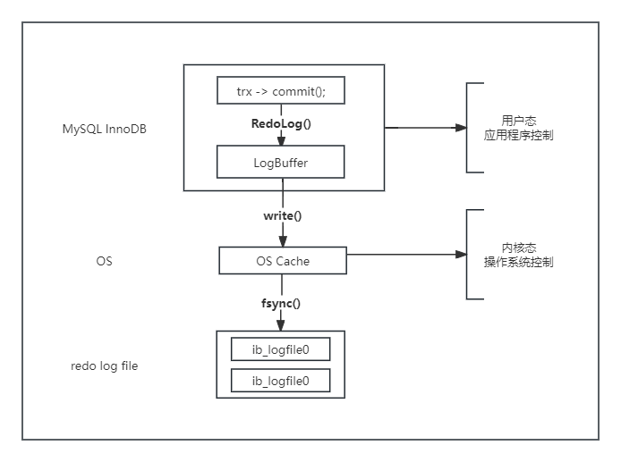
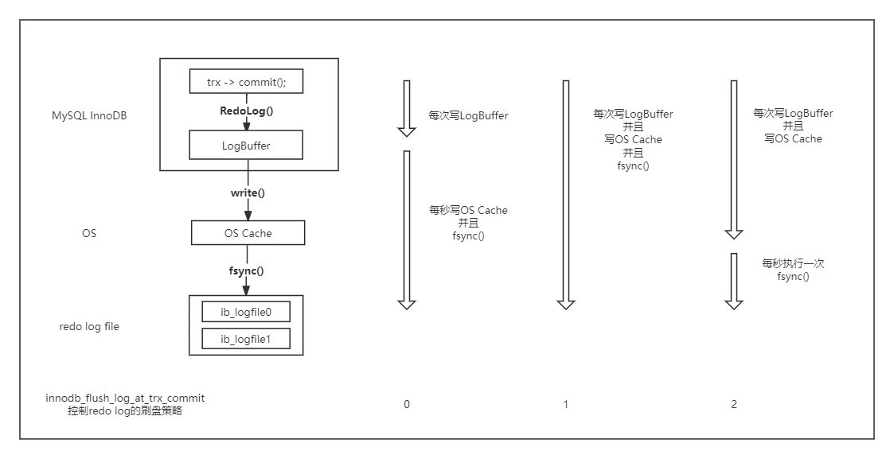

# 日志缓冲
日志缓存区是保存要写入磁盘日志文件的数据的内存区域。日志缓存区大小由innodb_log_buffer_size变量定义，默认大小为16MB。在更新、插入或删除很多的场景下，增加日志缓存区的大小可以节省磁盘I/O。

## redo log的三层架构

1. 事务提交，会写入log buffer，这里调用的是MySql自己的函数WriteRedoLog；
2. 只有当MySql发起系统调用write写文件时，log buffer里的数据，才会写到os cache。注意，MySql系统调用完write之后，就认为文件已经写完，如果不flush，什么时候落盘，是操作系统决定的；
3. 由操作系统（MySql也可以主动flush）将OS cache里的数据最终fsync到磁盘上。

以上步骤出现异常的情况：
1. 事务提交时，数据写入log buffer，就认为事务提交成功；
2. 如果写入log buffer的数据，write入OS cache之前，数据库崩溃，就会出现数据丢失；
3. 如果写入OS cache的数据，fsync入磁盘之前，操作系统崩溃，也可能出现数据丢失。

MySql有一个参数innodb_flush_log_at_trx_commit，能控制事务提交时，刷redo log的策略，如下图：  

策略一：最佳性能（innodb_flush_log_at_trx_commit=0）
每隔一秒，才将log buffer中的数据批量write入OS cache，同时MySql主动fsync。这种策略，如果数据库崩溃，有一秒的数据丢失。

策略二：强一致（innodb_flush_log_at_trx_commit=1）
每次事务提交，都将log buffer中的数据write入OS cache，同时MySql主动fsync。这种策略，是InnoDB的默认配置，为的是保证事务ACID特性。

策略三：折中（innodb_flush_log_at_trx_commit=2）
每次事务提交，都将log buffer中的数据write入OS cache，每隔一秒，MySql主动将OS cache中的数据批量fsync。这种策略，如果操作系统崩溃，最多有一秒的数据丢失。

高并发业务，最佳实践是使用第三种配置，这是因为：
1. 配置为0和配置为2，性能差异不大，因为将数据从log buffer拷贝到OS cache，虽然跨越用户态和内核态，但毕竟只是内存的数据拷贝。
2. 但安全性差异巨大，操作系统崩溃的概率相比MySql应用程序崩溃的概率，要小很多，设置为2，只要操作系统不崩溃，就不会丢失数据。

## 总结
1. 为了保证事务的ACID特性，理论上每次事务提交都应该刷盘，但此时的效率很低，优化方式有：
	* 随机写改为顺序写
	* 每次写改为批量写
2. redo log的三层架构：
	* log buffer
	* os cache
	* redo log
3. 三种策略：
	* 每秒write一次OS cache，同时fsync刷磁盘，性能好；
	* 每次write入OS cache，同时fsync刷磁盘，一致性好；
	* 每次write入OS cache，每秒fsync一次刷磁盘，折中。
4. 最佳实践：innodb_flush_log_at_trx_commit=2