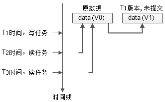

# 并发控制
为什么要进行并发控制（Concurrency Control）？

并发的任务对同一个数据进行操作，如果不采取措施，可能破坏数据的一致性。

技术上如何进行并发控制？
- 锁（Locking）
- 数据多版本（Multi Versioning）

## 锁
如何使用普通锁保证数据的完整性？
1. 操作数据前，锁住，实施互斥，不允许其它的并发任务操作；
2. 操作完成后，释放锁，让其他任务继续执行。

普通锁存在的问题：简单锁过于粗暴，连“读任务”也无法并行，任务执行过程本质上是串行。 共享锁和排他锁：
- 共享锁（**S**hare Locks，记为S锁），读取数据时加S锁。共享锁之间不互斥，简记为：读读可以并行
- 排他锁（e**X**clusive Locks，记为X锁），修改数据时加X锁。排它锁与任何锁互斥，简记为：写读，写写不可并行

可以看到，只要写数据的任务没有完成，数据是不能被其他任务读取的，这对并发度有较大的影响。 为了进一步提高并发，即使写任务没有完成，其他读任务也可以并发，这就引出了数据多版本。

## 数据多版本
数据多版本是一种能够进一步提高并发的方法，它的核心原理是：
1. 写任务发生时，将数据克隆一份，以版本号区分；
2. 写任务操作新克隆的数据，直至提交；
3. 并发读任务可以继续读取旧版本的数据，不至于阻塞。



如上图：
1. 最开始的数据版本是v0；
2. T1时刻发起一个写任务，这时把数据clone了一份，再修改克隆的数据，版本为v1，但任务还未完成；
3. T2时刻并发了一个读任务，依然可以读取v0版本的数据；
4. T3时刻又并发了一个读任务，依然不会阻塞；

提高并发的演进思路就是如此：
- 普通锁，本质是串行执行
- 读写锁，可以实现读读并发
- 数据多版本，可以实现读写并发

# redo，undo，回滚段
在进一步介绍InnoDB如何使用“读取旧版本数据”极大提高任务的并发之前，有必要先介绍下redo log，undo log，回滚段。

## 为什么要有redo log？
数据库事务提交后，必须将更新后的数据刷新到磁盘上，以保证ACID特性。磁盘随机写性能较低，如果每次都刷盘，会极大影响数据库吞吐量。优化方式是，将修改行为先写到redo log里（此时变成了顺序写），再定期将数据刷到磁盘上，这样能提高性能。
> 随机写优化为顺序写

另外，假如在某一时刻，数据库崩溃，还没来得及刷盘的数据，在数据库重启之后，会重做redo log里的内容。

**redo log用于保障已提交事务的ACID特性。**

## 为什么要有undo log？
一个撤销日志记录包含了关于如何撤销事务对记录的最新更改的信息。如果另一个事务需要在一致性读操作中查看原始数据，未修改的数据将从撤销日志记录中检索出来。或者当事务需要回滚时，undo log可以用于撤销事务对数据库产生的影响。

**undo log用于保障未提交事务不会对数据库的ACID特性产生影响。**

## 什么是回滚段？
回滚段是用来存储undo log的。

undo log和回滚段与InnoDB的MVCC密切相关。

# InnoDB是基于多版本并发控制的存储引擎
InnoDB是一个多版本存储引擎。它保留了有关更改行的旧版本的信息，以支持并发和回滚等事务功能。此信息存储在称为回滚段的数据结构中的系统表空间或撤消表空间中。InnoDB使用回滚段中的信息来执行事务回滚中所需的撤消操作。它还使用这些信息来构建行的早期版本，以实现一致的读取。

多版本并发控制（Mutli Version Concurrency Control, MVCC）就是通过“读取旧版本数据”来降低并发事务的锁冲突，提高任务的并发读。

InnoDB内核会对所有row数据增加三个属性：
1. DB_TRX_ID：6字节，记录当前行最近一次修改它的事务id。
2. DB_ROLL_PTR：7字节，记录指向写入回滚段的undo log的指针。
3. DB_ROW_ID：6字节，单调递增的行id。如果InnoDB自动生成聚簇索引，该索引将包含行ID值。否则，DB_ROW_ID列不会出现在任何索引中。

## InnoDB为什么能做到这么高的并发？
回滚的数据，其实是历史数据的快照（snapshot），这些数据是不会被修改的，select可以肆无忌惮的并发读取它们。

快照读（Snapshot Read），这种一致性不加锁的读（Consistent Nonlocking Read），就是InnoDB并发如此之高的原因之一。

这里的一致性是指：事务读取到的数据，要么是事务开始前就已经存在的数据（其它已提交事务产生的），要么是事务自身插入或者修改的数据。

## 什么样的select是快照读？
除非显示的加锁，否则所有的select都是快照读，例如：
```sql
sqlselect * from t where id > 2;
```
显示加锁，例如：
```sql
select * from t where id > 2 lock in share mode;
select * from t where id > 2 for update;
```

# 总结
1. 常见并发控制保证数据一致性的方法有锁，数据多版本；
2. 普通锁串行，共享锁读读并行，数据多版本读写并行；
3. redo log保证已提交事务的ACID特性，设计思路是，通过顺序写替代随机写，提高并发；
4. undo log用来回滚未提交的事务，它存储在回滚段里；
5. InnoDB是基于MVCC的存储引擎，它利用了存储在回滚段里的undo log，即数据的旧版本，提高并发；
6. InnoDB之所以并发高，快照读不加锁；
7. InnoDB所有普通select都是快照读。


