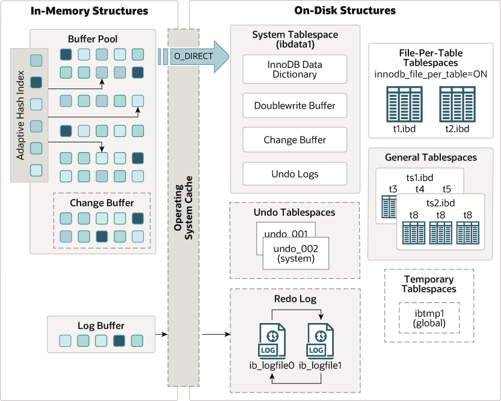

# MySQL架构

- Connection Manager：连接管理器负责处理客户端与MySQL服务器之间的连接，包括连接池和身份验证。
- SQL Interface：定义了标准化的接口，使应用程序能够使用SQL查询与关系数据库进行交互。
- Parser：负责分析SQL查询以了解其结构和语法，并将其分解为组件以供进一步处理。
- Optimizer：评估给定查询的各种执行计划，并选择最有效的执行计划来提高数据库操作的性能。
- Execution Engine：执行引擎负责实际执行查询，包括表扫描、索引使用、连接操作等。
- Management：数据库管理相关的功能和工具，主要包括配置、管理、集群解决方案、备份和恢复。
- Storage Engines：MySQL支持多个存储引擎，每个存储引擎负责数据的存储和管理。常见的存储引擎包括InnoDB、MyISAM、Memory、Archive等。

# InnoDB架构

1. In-Memory Structure  
Adaptive Hash Index：自适应哈希索引  
Log Buffer：日志缓冲区  
Buffer Pool：缓冲池  
Change Buffer：更改缓冲区

2. OS Cache

3. On-Disk Structure  
Doublewrite Buffer：双写缓冲区  
Redo Log：重做日志  
Undo Log：撤销日志  
Tablespace：表空间  
Tables：表  
Indexes：索引