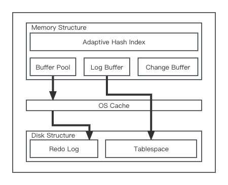

# MySQL架构

# InnoDB架构

1. In-Memory Structure  
Adaptive Hash Index：自适应哈希索引  
Log Buffer：日志缓冲区  
Buffer Pool：缓冲池  
Change Buffer：更改缓冲区

2. OS Cache

3. On-Disk Structure  
Doublewrite Buffer：双写缓冲区  
Redo Log：重做日志  
Undo Log：撤销日志  
Tablespace：表空间  
Tables：表  
Indexes：索引