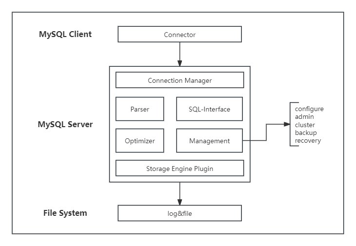

# MySQL架构

- Connection Manager：连接管理器负责处理客户端与MySQL服务器之间的连接，包括连接池和身份验证。
- SQL Interface：负责处理与客户端应用程序的交互，接收和解析SQL语句，并将其发送到适当的模块进行处理。
- Parser：解析器负责将SQL语句解析为内部数据结构，以便MySQL能够理解和执行查询。
- Optimizer：优化器根据查询的复杂性和可用的索引信息，选择最佳的查询执行计划，以提高查询性能。
- Execution Engine：执行引擎负责实际执行查询，包括表扫描、索引使用、连接操作等。
- Management：管理相关的功能和工具，主要包括配置、管理、集群解决方案、备份和恢复。
- Storage Engines：MySQL支持多个存储引擎，每个存储引擎负责数据的存储和管理。常见的存储引擎包括InnoDB、MyISAM、Memory、Archive等。

# InnoDB架构

1. In-Memory Structure  
Adaptive Hash Index：自适应哈希索引  
Log Buffer：日志缓冲区  
Buffer Pool：缓冲池  
Change Buffer：更改缓冲区

2. OS Cache

3. On-Disk Structure  
Doublewrite Buffer：双写缓冲区  
Redo Log：重做日志  
Undo Log：撤销日志  
Tablespace：表空间  
Tables：表  
Indexes：索引