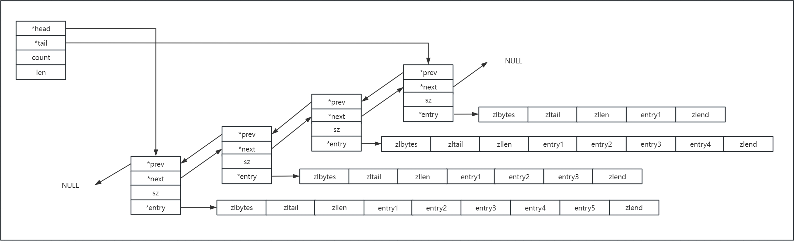

# List（quicklist）
数据结构是一个双向链表，有一个头指针指向链表的第一个元素和一个尾指针指向链表的最后一个元素。但是考虑到链表的附加空间，prev 和 next 指针就要占去 16 个字节 (64bit 系统的指针是 8 个字节)，另外每个节点的内存都是单独分配，会加剧内存的碎片化，影响内存管理效率。因此Redis3.2版本开始对列表数据结构进行了改造，使用 quicklist 代替了 ziplist 和 linkedlist。



quicklist 实际上是 ziplist 和 linkedList 的混合体，它将 linkedList 按段切分，每一段使用 ziplist 来紧凑存储，多个 ziplist 之间使用双向指针串接起来。

quicklist 内部默认定义的单个 ziplist 的大小为 8k 字节。超过这个大小，就会重新分配一个 ziplist 了。这个阈值大小可以由参数list-max-ziplist-size控制。
```
# Lists are also encoded in a special way to save a lot of space.
# The number of entries allowed per internal list node can be specified
# as a fixed maximum size or a maximum number of elements.
# For a fixed maximum size, use -5 through -1, meaning:
# -5: max size: 64 Kb  <-- not recommended for normal workloads
# -4: max size: 32 Kb  <-- not recommended
# -3: max size: 16 Kb  <-- probably not recommended
# -2: max size: 8 Kb   <-- good
# -1: max size: 4 Kb   <-- good
# Positive numbers mean store up to _exactly_ that number of elements
# per list node.
# The highest performing option is usually -2 (8 Kb size) or -1 (4 Kb size),
# but if your use case is unique, adjust the settings as necessary.
list-max-ziplist-size -2
```

quicklist 可以对 ziplist 来进行压缩，而且可以指定压缩深度，由参数list-compress-depth控制。默认的压缩深度为 0, 也就是所有的节点都不压缩。为了支持快速的 push/pop 操作，quicklist 两端的第一个 ziplist 不进行压缩，这时压缩深度为 1。如果压缩深度为 2, 则是两端各自两个 ziplist 不压缩。
```
# Lists may also be compressed.
# Compress depth is the number of quicklist ziplist nodes from *each* side of
# the list to *exclude* from compression.  The head and tail of the list
# are always uncompressed for fast push/pop operations.  Settings are:
# 0: disable all list compression
# 1: depth 1 means "don't start compressing until after 1 node into the list,
#    going from either the head or tail"
#    So: [head]->node->node->...->node->[tail]
#    [head], [tail] will always be uncompressed; inner nodes will compress.
# 2: [head]->[next]->node->node->...->node->[prev]->[tail]
#    2 here means: don't compress head or head->next or tail->prev or tail,
#    but compress all nodes between them.
# 3: [head]->[next]->[next]->node->node->...->node->[prev]->[prev]->[tail]
# etc.
list-compress-depth 0
```

应用：
- 同向命令（LPUSH LPOP）实现了栈
- 反向命令（LPSUH RPOP）实现了队列
- 通过索引操作List（LINDEX LSET）实现了数组
- 阻塞的单播队列（BLPOP LPUSH）