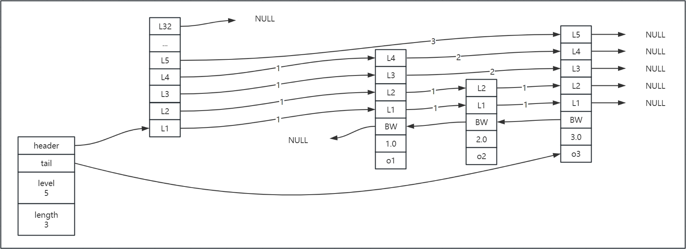

# Set（intset、hashtable）
集合操作（交，并，差）

SRANDMEMBER

## intset
整数集合intset是集合键的底层实现之一，当一个集合只包含整数值的元素，并且这个集合的元素数量不多时，redis会使用整数集合作为集合键的底层实现。

# Sorted_Set（ziplist、skiplist）
物理内存左小右大，不随命令发生变化

具有集合操作指令，同时带有权重、聚合指令

底层数据结构是**跳跃表**（随机造层）

## skiplist
Redis使用跳跃表作为有序集合键的底层实现之一，如果一个有序集合包含的元素数量超过128，又或者有序集合中元素的成员大小超过64字节时，Redis就会使用跳跃表来作为有序集合的底层实现。控制参数如下：
```
# Similarly to hashes and lists, sorted sets are also specially encoded in
# order to save a lot of space. This encoding is only used when the length and
# elements of a sorted set are below the following limits:
zset-max-ziplist-entries 128
zset-max-ziplist-value 64
```

Redis的跳跃表由zskiplistNode和zskiplist两个结构定义，其中 zskiplistNode结构用于表示跳跃表节点，而 zskiplist结构则用于保存跳跃表节点的相关信息，如下：
```c
typedef struct zskiplistNode {
    sds ele;
    double score;
    struct zskiplistNode *backward;
    struct zskiplistLevel {
        struct zskiplistNode *forward;
        unsigned long span;
    } level[];
} zskiplistNode;

typedef struct zskiplist {
    struct zskiplistNode *header, *tail;
    unsigned long length;
    int level;
} zskiplist;
```
> 定义位于src/server.h文件中



**zskiplist**
- header：指向跳跃表的表头节点，通过这个指针程序定位表头节点的时间复杂度就为O(1)。
- tail：指向跳跃表的表尾节点，通过这个指针程序定位表尾节点的时间复杂度就为O(1)。
- level：记录目前跳跃表内，层数最大的那个节点的层数（表头节点的层数不计算在内），通过这个属性可以再O(1)的时间复杂度内获取层高最好的节点的层数。
- length：记录跳跃表的长度，也即是，跳跃表目前包含节点的数量（表头节点不计算在内)，通过这个属性，程序可以再O(1)的时间复杂度内返回跳跃表的长度。

**zskiplistNode**
- 层(level)：
    - 节点中用L1、L2、L3等字样标记节点的各个层，L1代表第一层，L2代表第二层，以此类推。
    - 每个层都带有两个属性：前进指针和跨度。前进指针用于访问位于表尾方向的其他节点，而跨度则记录了前进指针所指向节点和当前节点的距离（跨度越大、距离越远）。在上图中，连线上带有数字的箭头就代表前进指针，而那个数字就是跨度。当程序从表头向表尾进行遍历时，访问会沿着层的前进指针进行。
    - 每次创建一个新跳跃表节点的时候，程序都根据幂次定律（powerlaw，越大的数出现的概率越小）随机生成一个介于1和32之间的值作为level数组的大小，这个大小就是层的“高度”。
- 后退(backward)指针：
    - 节点中用BW字样标记节点的后退指针，它指向位于当前节点的前一个节点。后退指针在程序从表尾向表头遍历时使用。与前进指针所不同的是每个节点只有一个后退指针，因此每次只能后退一个节点。
- 分值(score)：
    - 各个节点中的1.0、2.0和3.0是节点所保存的分值。在跳跃表中，节点按各自所保存的分值从小到大排列。
- 成员对象(obj)：
    - 各个节点中的o1、o2和o3是节点所保存的成员对象。在同一个跳跃表中，各个节点保存的成员对象必须是唯一的，但是多个节点保存的分值却可以是相同的：分值相同的节点将按照成员对象在字典序中的大小来进行排序，成员对象较小的节点会排在前面（靠近表头的方向），而成员对象较大的节点则会排在后面（靠近表尾的方向）。

## 应用场景
- 排行榜
- 延时队列